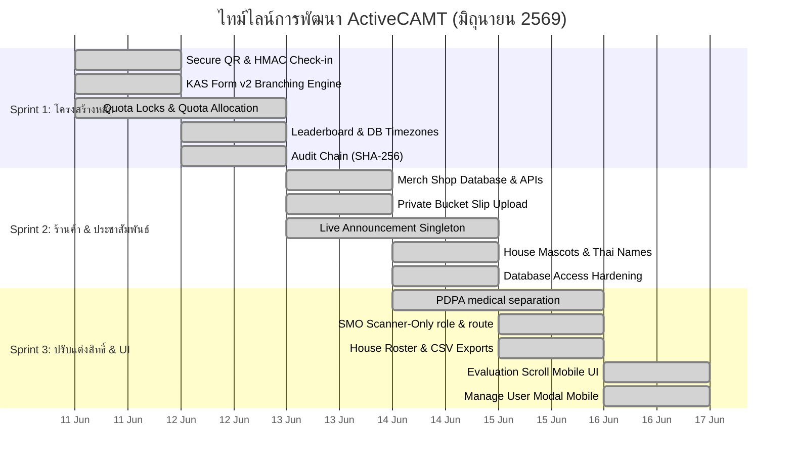

# 🚀 ActiveCAMT — แผนงานและสรุปการพัฒนาแต่ละระยะ (Sprint Planning & Roadmap)

**เวอร์ชัน:** 1.0 | **อัปเดตล่าสุด:** 2026-06-18  
**สถานะ:** เสร็จสมบูรณ์ (เวอร์ชัน 1.2)  
**ลิงก์ดัชนี:** [กลับหน้าหลัก](../index.md)

---

## 1. ตารางสรุปการเปิดตัวระบบ (Release Schedule Overview)

การพัฒนา ActiveCAMT แบ่งรอบการทำงานออกเป็น 3 Sprints หลัก ดังนี้:

| Sprint | ช่วงเวลาการพัฒนา | จุดเน้นย่อย (Focus Area) | สถานะ |
| :--- | :--- | :--- | :--- |
| **Sprint 1** | 11–12 มิ.ย. 2569 | ระบบเช็คอิน, ฟอร์ม KAS, ลีดเดอร์บอร์ดรายบุคคล และโครงสร้างความปลอดภัยหลัก | เสร็จสมบูรณ์ |
| **Sprint 2** | 13–14 มิ.ย. 2569 | ระบบร้านค้าของที่ระลึก (Merch Shop), ประกาศใน Dashboard และความปลอดภัยของฐานข้อมูล | เสร็จสมบูรณ์ |
| **Sprint 3** | 14–16 มิ.ย. 2569 | สิทธิ์ของ SMO (Scanner-only), ความเป็นส่วนตัวระดับฟิลด์ (PDPA) และการรองรับมือถือ | เสร็จสมบูรณ์ |

---

## 2. ไทม์ไลน์การพัฒนาซอฟต์แวร์ (Mermaid Gantt Chart)

---

## 3. รายละเอียดการทำงานของแต่ละระยะ (Sprint Details)

### 3.1 Sprint 1 (11–12 มิ.ย. 69) — ระบบเช็คอิน, ฟอร์ม KAS และความปลอดภัยหลัก
* **หัวใจสำคัญ:** พัฒนาสถาปัตยกรรมด้านการเช็คอินแบบไร้กระดาษ และสร้างตัวประเมินผลทักษะความรู้แบบอัตโนมัติ
* **สิ่งที่ทำเสร็จ:**
  * โทเค็นคิวอาร์เช็คอินเซ็นด้วย HMAC-SHA256 อายุ 5 นาที ยืนยันตัวตนแบบปลอดภัยข้ามช่องทาง (Timing-Safe verification)
  * โครงสร้างแบบประเมิน KAS แตกเซกชัน (Section Branching) ปิดรับฟอร์มอัตโนมัติตามเวลา และส่งออกข้อมูลเป็นไฟล์ XLSX
  * ควบคุมโควต้ารวม โควต้า Walk-in โควต้าแยกไทย/อินเตอร์ โดยรัน Row Lock กันข้อมูลผิดพลาด (Race Condition)
  * ออกแบบลีดเดอร์บอร์ดแบบเรียงลำดับแน่นอน ป้องกันคะแนนเสมอแล้วดึงข้อมูลผิดเพี้ยน
  * บันทึกความปลอดภัย Audit log ทำโครงสร้าง Hash Chain SHA256 ป้องกันแฮกเกอร์แก้ไขล็อกย้อนหลัง

### 3.2 Sprint 2 (13–14 มิ.ย. 69) — ระบบของที่ระลึก, การประชาสัมพันธ์ และความแข็งแกร่งฐานข้อมูล
* **หัวใจสำคัญ:** เพิ่มระบบร้านค้าอำนวยความสะดวกในการขายของที่ระลึก และปรับปรุงแบรนด์ดิ้งประจำบ้าน
* **สิ่งที่ทำเสร็จ:**
  * โครงสร้างฐานข้อมูลร้านค้า Merch ครบชุด พร้อมระบบ Variant ขนาด สต็อกสินค้าแยกย่อย และระบบอัปโหลดสลิป
  * **Private Slips Bucket:** เก็บหลักฐานการเงินไว้ในพื้นที่ปิดส่วนบุคคล ป้องกันลิงก์สลิปรั่วไหลสู่สาธารณะ
  * ตัวจัดการแบนเนอร์ประกาศสำคัญ (Announcement Banner) ในหน้านักศึกษา แก้ไข rich text และเปิด-ปิดได้สดจากแอดมินหลังบ้าน
  * จัดทำภาพโลโก้มาสคอตประจำบ้านทั้ง 4 บ้าน (มอม/โต/ลวง/มกร) แบบโปร่งใส น้ำหนักเบาสำหรับโมบายบราวเซอร์
  * ปรับแต่งสิทธิ์ความปลอดภัย: นำการเชื่อมต่อ PostgreSQL พอร์ตสาธารณะ 5432 ออก, สแกนโค้ดสคริปต์ CLI ให้ห้ามรันบนโปรดักชันหากไม่มีการพิมพ์ยืนยันสิทธิ์

### 3.3 Sprint 3 (14–16 มิ.ย. 69) — ความเป็นส่วนตัว PDPA, สิทธิ์ SMO และแก้บั๊กอุปกรณ์เคลื่อนที่
* **หัวใจสำคัญ:** ปรับแต่งสิทธิ์ความเป็นส่วนตัวให้เป็นไปตามข้อกำหนดกฎหมายคุ้มครองข้อมูลส่วนบุคคล (PDPA) และปรับปรุง UI บนมือถือ
* **สิ่งที่ทำเสร็จ:**
  * **PDPA Medical separation:** แยกข้อมูลการแพทย์ออกเป็นสองชุด: เจ้าหน้าที่หน้าสแกนเห็นเพียง "สัญญาณเตือนเรื่องสุขภาพ" (เป็นระดับแปลแล้ว เช่น มีโรคประจำตัว) ส่วนข้อมูลโรคจริงและใบสั่งแพทย์เปิดเผยเฉพาะผู้ดูแลสูงสุด (Admin) เท่านั้น
  * **SMO Scanner-Only:** บทบาท SMO สามารถเข้าช่วยแอดมินสแกนเช็คอินหน้างานได้ทันทีผ่านสิทธิ์แบบกล้องอย่างเดียว โดยไม่ผ่านหน้าข้อมูลอื่นๆ ของแอดมินส่วนกลาง
  * พัฒนาหน้าแสดงสมาชิกประจำบ้าน (House rosters) และปุ่มดาวน์โหลดรายงานข้อมูลผู้เข้าร่วมงานสำหรับแอดมิน
  * แก้ไข UI หน้าแบบประเมินให้มีขนาดพอเหมาะกับการเลื่อนบนหน้าจอมือถือ และปรับโมดัลแก้ไขรายละเอียดผู้ใช้ไม่ให้ล้นออกนอกจอสมาร์ทโฟน

---

## Related Documents
- [01-product-backlog.md](./01-product-backlog.md) — รายการ Backlog และความต้องการผู้ใช้
- [01-system-design.md](../software/01-system-design.md) — สถาปัตยกรรมและรายละเอียด Subsystem
