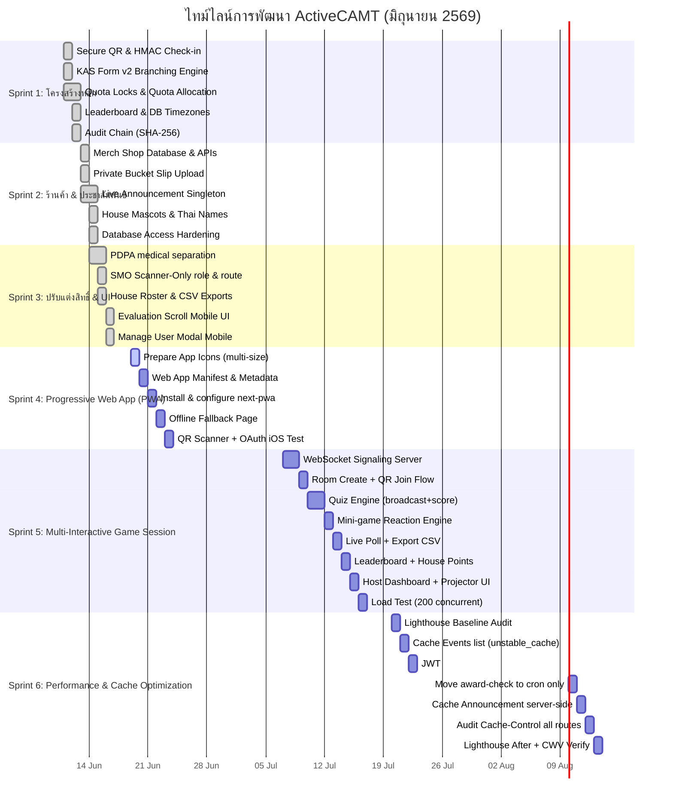

# 🚀 ActiveCAMT — แผนงานและสรุปการพัฒนาแต่ละระยะ (Sprint Planning & Roadmap)

**เวอร์ชัน:** 1.1 | **อัปเดตล่าสุด:** 2026-06-18  
**สถานะ:** Sprint 1–3 เสร็จสมบูรณ์ (v1.2) | Sprint 4 (PWA) อยู่ในแผน  
**ลิงก์ดัชนี:** [กลับหน้าหลัก](../index.md)

---

## 1. ตารางสรุปการเปิดตัวระบบ (Release Schedule Overview)

การพัฒนา ActiveCAMT แบ่งรอบการทำงานออกเป็น 3 Sprints หลัก ดังนี้:

| Sprint | ช่วงเวลาการพัฒนา | จุดเน้นย่อย (Focus Area) | สถานะ |
| :--- | :--- | :--- | :--- |
| **Sprint 1** | 11–12 มิ.ย. 2569 | ระบบเช็คอิน, ฟอร์ม KAS, ลีดเดอร์บอร์ดรายบุคคล และโครงสร้างความปลอดภัยหลัก | เสร็จสมบูรณ์ |
| **Sprint 2** | 13–14 มิ.ย. 2569 | ระบบร้านค้าของที่ระลึก (Merch Shop), ประกาศใน Dashboard และความปลอดภัยของฐานข้อมูล | เสร็จสมบูรณ์ |
| **Sprint 3** | 14–16 มิ.ย. 2569 | สิทธิ์ของ SMO (Scanner-only), ความเป็นส่วนตัวระดับฟิลด์ (PDPA) และการรองรับมือถือ | เสร็จสมบูรณ์ |
| **Sprint 4** | TBD | Progressive Web App (PWA) — ติดตั้งแอปบน Home Screen, Offline Fallback, App Manifest & Service Worker | 📋 วางแผน |
| **Sprint 5** | TBD | Multi-Interactive Game Session (WebRTC/WebSocket) — Quiz, Mini-game, Live Poll, Leaderboard และ House Points Integration | 📋 วางแผน |
| **Sprint 6** | TBD | Performance & API Cache Optimization — ลด DB query, JWT session caching, hot-path cleanup และวัด Core Web Vitals | 📋 วางแผน |

---

## 2. ไทม์ไลน์การพัฒนาซอฟต์แวร์ (Mermaid Gantt Chart)

---

## 3. รายละเอียดการทำงานของแต่ละระยะ (Sprint Details)

### 3.0 Sprint 4 (TBD) — Progressive Web App (PWA)
* **หัวใจสำคัญ:** แปลง ActiveCAMT ให้รองรับการติดตั้งและใช้งานแบบ Native App บนมือถือทั้ง Android และ iOS โดยไม่ต้องผ่าน App Store
* **User Stories:** [US-PWA-17a ถึง 17d](./01-product-backlog.md#14-progressive-web-app-pwa--ติดตั้งใช้งานแบบ-native-app-บนมือถือ)
* **งานที่ต้องทำ:**

| Task | รายละเอียด | ข้อควรระวัง |
| :--- | :--- | :--- |
| **S4-1** Prepare App Icons | Resize `smocamt-logo-icon.png` จาก 256×256 ให้ครบ: 192×192, 512×512 และ 512×512 Maskable | ไอคอน Maskable ต้องมี Safe Zone 80% ตรงกลาง เพื่อให้ Android ตัดขอบเป็น Circle/Squircle ได้ |
| **S4-2** Web App Manifest | สร้าง `manifest.json` ใน `/public` และเชื่อมต่อผ่าน Next.js `metadata.manifest` ใน `layout.tsx` | กำหนด `start_url: "/"`, `display: "standalone"`, `orientation: "portrait"`, `theme_color` ตรงกับ Design System |
| **S4-3** Install & Configure next-pwa | ติดตั้ง `@ducanh2912/next-pwa` และ config ใน `next.config.ts` เปิดใช้งาน Service Worker | CSP header `worker-src 'self' blob:` มีอยู่แล้ว ไม่ต้องแก้ ทดสอบ Build ด้วย `next build` ก่อน Deploy |
| **S4-4** Offline Fallback Page | สร้างหน้า `src/app/offline/page.tsx` พร้อม App Shell caching strategy | Service Worker ต้อง Cache หน้า `/offline` ไว้ล่วงหน้า และ Intercept `fetch` ที่ล้มเหลวด้วย Network-First strategy |
| **S4-5** QR Scanner & OAuth Testing | ทดสอบ `html5-qrcode` Camera permission และ Google OAuth redirect ใน PWA Standalone Mode | iOS Safari: `getUserMedia` ใน Standalone mode มีข้อจำกัด ต้องทดสอบบนอุปกรณ์จริง — อาจต้องเพิ่ม fallback "เปิดใน Safari" |

* **Definition of Done:**ติดตั้งได้บน Android Chrome และ iOS Safari, Lighthouse PWA Score ≥ 90, QR Scanner และ Google Login ทำงานได้ใน Standalone mode

---

### 3.1 Sprint 1 (11–12 มิ.ย. 69) — ระบบเช็คอิน, ฟอร์ม KAS และความปลอดภัยหลัก
* **หัวใจสำคัญ:** พัฒนาสถาปัตยกรรมด้านการเช็คอินแบบไร้กระดาษ และสร้างตัวประเมินผลทักษะความรู้แบบอัตโนมัติ
* **สิ่งที่ทำเสร็จ:**
  * โทเค็นคิวอาร์เช็คอินเซ็นด้วย HMAC-SHA256 อายุ 5 นาที ยืนยันตัวตนแบบปลอดภัยข้ามช่องทาง (Timing-Safe verification)
  * โครงสร้างแบบประเมิน KAS แตกเซกชัน (Section Branching) ปิดรับฟอร์มอัตโนมัติตามเวลา และส่งออกข้อมูลเป็นไฟล์ XLSX
  * ควบคุมโควต้ารวม โควต้า Walk-in โควต้าแยกไทย/อินเตอร์ โดยรัน Row Lock กันข้อมูลผิดพลาด (Race Condition)
  * ออกแบบลีดเดอร์บอร์ดแบบเรียงลำดับแน่นอน ป้องกันคะแนนเสมอแล้วดึงข้อมูลผิดเพี้ยน
  * บันทึกความปลอดภัย Audit log ทำโครงสร้าง Hash Chain SHA256 ป้องกันแฮกเกอร์แก้ไขล็อกย้อนหลัง

### 3.2 Sprint 2 (13–14 มิ.ย. 69) — ระบบของที่ระลึก, การประชาสัมพันธ์ และความแข็งแกร่งฐานข้อมูล
* **หัวใจสำคัญ:** เพิ่มระบบร้านค้าอำนวยความสะดวกในการขายของที่ระลึก และปรับปรุงแบรนด์ดิ้งประจำบ้าน
* **สิ่งที่ทำเสร็จ:**
  * โครงสร้างฐานข้อมูลร้านค้า Merch ครบชุด พร้อมระบบ Variant ขนาด สต็อกสินค้าแยกย่อย และระบบอัปโหลดสลิป
  * **Private Slips Bucket:** เก็บหลักฐานการเงินไว้ในพื้นที่ปิดส่วนบุคคล ป้องกันลิงก์สลิปรั่วไหลสู่สาธารณะ
  * ตัวจัดการแบนเนอร์ประกาศสำคัญ (Announcement Banner) ในหน้านักศึกษา แก้ไข rich text และเปิด-ปิดได้สดจากแอดมินหลังบ้าน
  * จัดทำภาพโลโก้มาสคอตประจำบ้านทั้ง 4 บ้าน (มอม/โต/ลวง/มกร) แบบโปร่งใส น้ำหนักเบาสำหรับโมบายบราวเซอร์
  * ปรับแต่งสิทธิ์ความปลอดภัย: นำการเชื่อมต่อ PostgreSQL พอร์ตสาธารณะ 5432 ออก, สแกนโค้ดสคริปต์ CLI ให้ห้ามรันบนโปรดักชันหากไม่มีการพิมพ์ยืนยันสิทธิ์

### 3.3 Sprint 3 (14–16 มิ.ย. 69) — ความเป็นส่วนตัว PDPA, สิทธิ์ SMO และแก้บั๊กอุปกรณ์เคลื่อนที่
* **หัวใจสำคัญ:** ปรับแต่งสิทธิ์ความเป็นส่วนตัวให้เป็นไปตามข้อกำหนดกฎหมายคุ้มครองข้อมูลส่วนบุคคล (PDPA) และปรับปรุง UI บนมือถือ
* **สิ่งที่ทำเสร็จ:**
  * **PDPA Medical separation:** แยกข้อมูลการแพทย์ออกเป็นสองชุด: เจ้าหน้าที่หน้าสแกนเห็นเพียง "สัญญาณเตือนเรื่องสุขภาพ" (เป็นระดับแปลแล้ว เช่น มีโรคประจำตัว) ส่วนข้อมูลโรคจริงและใบสั่งแพทย์เปิดเผยเฉพาะผู้ดูแลสูงสุด (Admin) เท่านั้น
  * **SMO Scanner-Only:** บทบาท SMO สามารถเข้าช่วยแอดมินสแกนเช็คอินหน้างานได้ทันทีผ่านสิทธิ์แบบกล้องอย่างเดียว โดยไม่ผ่านหน้าข้อมูลอื่นๆ ของแอดมินส่วนกลาง
  * พัฒนาหน้าแสดงสมาชิกประจำบ้าน (House rosters) และปุ่มดาวน์โหลดรายงานข้อมูลผู้เข้าร่วมงานสำหรับแอดมิน
  * แก้ไข UI หน้าแบบประเมินให้มีขนาดพอเหมาะกับการเลื่อนบนหน้าจอมือถือ และปรับโมดัลแก้ไขรายละเอียดผู้ใช้ไม่ให้ล้นออกนอกจอสมาร์ทโฟน

### 3.4 Sprint 5 (TBD) — Multi-Interactive Game Session

* **หัวใจสำคัญ:** สร้างระบบ Interactive Game Session แบบ Real-time ให้ Staff สามารถ Host เกม (Quiz / Mini-game / Live Poll) และผู้เข้าร่วมงาน Join ผ่าน QR Code หรือ Room Code บนมือถือ
* **User Stories:** [US-GAME-18a ถึง 18i](./01-product-backlog.md#15-multi-interactive-game-session-webrtc--เกมร่วมกันแบบ-real-time-ในงาน)

#### ⚙️ หมายเหตุสถาปัตยกรรม: WebRTC vs WebSocket

| เทคโนโลยี | ข้อดี | ข้อจำกัด | คำแนะนำสำหรับโปรเจกต์นี้ |
| :--- | :--- | :--- | :--- |
| **WebSocket (Socket.IO)** | ง่ายต่อการ Implement, Scale บน Server ได้ดี, รองรับ 200+ clients | Latency ขึ้นอยู่กับ Server | **แนะนำสำหรับ Quiz และ Poll** — ผ่าน Server ทำให้ควบคุม Timestamp และป้องกันการโกงได้ |
| **WebRTC Data Channel** | Latency ต่ำมาก (Peer-to-Peer) | ซับซ้อน, ต้องการ STUN/TURN server, Scale ยากเมื่อ participants มาก | **พิจารณาสำหรับ Mini-game Reaction** เฉพาะกรณีต้องการ Latency < 50ms จริงๆ |

**สรุปแนะนำ:** ใช้ **Socket.IO บน Next.js API Route / Separate Node server** เป็น Core ทั้ง 3 game types ก่อน หาก Reaction game มีปัญหา Latency จึงค่อย Hybrid กับ WebRTC Data Channel ใน Iteration ถัดไป

#### งานที่ต้องทำ (Task Breakdown)

| Task | รายละเอียด | ข้อควรระวัง |
| :--- | :--- | :--- |
| **S5-1** WebSocket Signaling Server | ติดตั้ง Socket.IO บน Standalone Node server (แยกจาก Next.js เพื่อรองรับ persistent connections) และ Deploy คู่กับ docker-compose | Next.js App Router ไม่รองรับ WebSocket native — ต้องเพิ่ม `socket-server` service ใน `docker-compose.yml` |
| **S5-2** Room Create + QR Join Flow | API สร้าง Room Code 6 หลัก, Generate QR URL, หน้า Lobby สำหรับ Host และ Participant | Room Code ต้อง unique ในช่วงเวลานั้น — ใช้ short-lived Redis หรือ In-memory store |
| **S5-3** Quiz Engine | Broadcast คำถามพร้อม Timer, รับคำตอบ, คำนวณคะแนน (ความถูก × ความเร็ว) | Timestamp ต้องบันทึกที่ Server ณ เวลาที่ Message ถึง — ไม่เชื่อ `client_time` |
| **S5-4** Mini-game Reaction Engine | "GO!" signal broadcast, รับ tap events แข่ง Latency | ต้องทดสอบกับ Network delay จริงในงาน (WiFi 5GHz > WiFi 2.4GHz > 4G) |
| **S5-5** Live Poll + Export CSV | Multi-choice vote, Real-time Bar/Donut chart, Export ผลเป็น CSV | ป้องกัน Double-vote ด้วย Socket session ID หรือ nickname-lock |
| **S5-6** Leaderboard + House Points | Aggregate คะแนน, Animation อันดับ, Award House Points ให้ @cmu.ac.th | Award Points ต้องผ่าน Audit Log เหมือนระบบ Points ปกติ (US-AUDT-07) |
| **S5-7** Host Dashboard + Projector UI | หน้า Host ที่ฉายบนจอใหญ่ได้ (Full-screen, Font ใหญ่), QR Code แสดงชัด | ทดสอบ Resolution 1080p บน Projector จริง |
| **S5-8** Load Test (200 concurrent) | ทดสอบ Socket connections พร้อมกัน 200 คน วัด Latency และ Memory | ใช้ `artillery` หรือ `k6` สำหรับ WebSocket load test |

* **Definition of Done:** Host สร้าง Room ได้, ผู้เข้าร่วม 200 คน Join พร้อมกันได้, ทั้ง 3 game modes ทำงานได้ไม่มี Error, House Points เชื่อมถูกต้อง, Latency Quiz < 500ms บน WiFi ปกติ

### 3.5 Sprint 6 (TBD) — Performance & API Cache Optimization

* **หัวใจสำคัญ:** ลด DB query ต่อ request ในทุก hot-path ที่ถูก poll บ่อย, เพิ่ม Cache layer ที่เหมาะสม และวัดผลด้วย Lighthouse + Vercel Speed Insights ก่อนและหลัง
* **User Stories:** [US-OPT-19a ถึง 19f](./01-product-backlog.md#16-performance--api-cache-optimization--ความเร็วและประสิทธิภาพระบบ)

#### Bottleneck ที่พบจาก Code Review

| จุดปัญหา | ไฟล์ | ผลกระทบ | วิธีแก้ |
| :--- | :--- | :--- | :--- |
| `/api/events` ทำ **4 DB queries** ต่อ request | `src/app/api/events/route.ts` | Poll ทุก 60s × จำนวนนักศึกษา = query จำนวนมาก | แยก static events ออก + `unstable_cache` |
| `user.major` ถูก query จาก DB **ทุก API call** | `src/app/api/events/route.ts` L.58 | 1 extra round-trip ทุก request | ย้ายเข้า JWT session |
| `checkAndAwardClosedForms()` รันบน **hot-path** `/api/houses` | `src/app/api/houses/route.ts` L.17 | ทำให้ Leaderboard ช้าเมื่อมี pending forms | ย้ายไป Cron Job เท่านั้น |
| Announcement fetch เป็น **client-side polling** แยก | `DashboardClient.tsx` | เพิ่ม request โดยไม่จำเป็น | Pre-fetch บน Server Component + cache tag |

#### งานที่ต้องทำ (Task Breakdown)

| Task | รายละเอียด | File ที่แก้ |
| :--- | :--- | :--- |
| **S6-1** Lighthouse Baseline | วัด LCP, INP, CLS บน Dashboard + Login ก่อนแตะโค้ด บันทึกตัวเลขไว้เปรียบเทียบ | — |
| **S6-2** Cache Events list | ใช้ `unstable_cache` ครอบ events query, ตั้ง tag `"events"`, เรียก `revalidateTag("events")` ใน Admin event routes | `api/events/route.ts`, `api/admin/events/route.ts` |
| **S6-3** JWT major field | เพิ่ม `major` ใน NextAuth `jwt` + `session` callback, ลบ `findFirst({ major })` ออกจาก events route | `src/auth.ts`, `api/events/route.ts` |
| **S6-4** Move award-check to cron | ลบ `checkAndAwardClosedForms()` จาก `api/houses/route.ts` ออก, ตรวจสอบว่า `api/cron/award-points` ครอบคลุม | `api/houses/route.ts`, `api/cron/award-points/route.ts` |
| **S6-5** Server-side Announcement | ย้าย Announcement fetch เข้า Server Component ใน `dashboard/page.tsx` พร้อม `unstable_cache` tag `"announcement"` | `app/dashboard/page.tsx`, `DashboardClient.tsx` |
| **S6-6** Cache-Control Audit | ตรวจสอบทุก API route ว่ามี `Cache-Control` header ถูกต้องตาม public/private/mutable data | ทุก `route.ts` |
| **S6-7** Lighthouse After + CWV | วัดซ้ำหลัง deploy และ verify กับ Vercel Speed Insights ว่า LCP ≤ 2.5s, CLS ≤ 0.1 บน Mobile | — |

* **Definition of Done:** `/api/events` response time ลดลง ≥ 40% บน Cache hit, Lighthouse Performance Score ≥ 85 บน Mobile, ไม่มี regression ใน feature ที่มีอยู่

---

## Related Documents
- [01-product-backlog.md](./01-product-backlog.md) — รายการ Backlog และความต้องการผู้ใช้
- [01-system-design.md](../software/01-system-design.md) — สถาปัตยกรรมและรายละเอียด Subsystem
