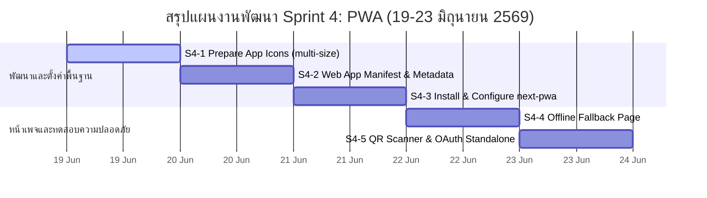

# Sprint 04: Progressive Web App (PWA)

**Goal:** แปลง ActiveCAMT ให้รองรับการติดตั้งและใช้งานแบบ Native App (PWA) บนมือถือทั้ง Android และ iOS, รองรับการทำงานแบบ Offline Fallback และกล้องสแกน QR Code ในโหมด Standalone ได้อย่างสมบูรณ์
**Timeline:** 2026-06-19 → 2026-06-23 (5 วัน)
**Version:** 1.0 | **Last Updated:** 2026-06-18
**Status:** 🔵 Active

---

## 📅 Internal Timeline (Gantt Chart)

---

## 📋 Committed Stories & Tasks

| ID | Story / Task | Owner | Estimate | Status |
| :--- | :--- | :--- | :--- | :--- |
| **[US-PWA-17a](../user-stories/archives/US-PWA-17a.md)** | **ติดตั้งแอปบน Home Screen (Add to Home Screen)** - จัดทำ Metadata และ Link manifest - รองรับ Android/iOS standalone mode | Developer | 8 hrs | [ ] |
| **[US-PWA-17b](../user-stories/archives/US-PWA-17b.md)** | **หน้า Offline Fallback Page** - สร้างหน้า `offline/page.tsx` - ตั้งค่า Cache Strategy ใน Service Worker | Developer | 8 hrs | [ ] |
| **[US-PWA-17c](../user-stories/archives/US-PWA-17c.md)** | **ประสบการณ์แบบ Native App (Splash & Theme)** - เจนไอคอนขนาดต่าง ๆ (192, 512, maskable) - กำหนดค่า Theme/Background Color | UI/UX Dev | 6 hrs | [ ] |
| **[US-PWA-17d](../user-stories/archives/US-PWA-17d.md)** | **QR Scanner ทำงานได้ใน PWA Mode** - ทดสอบสิทธิ์กล้องใน standalone mode บน Safari iOS/Chrome Android | QA & Dev | 8 hrs | [ ] |

---

## 🛠 Sprint Specifics

### Tasks Breakdown (รายละเอียดงานย่อย)

*   **S4-1: Prepare App Icons (ไอคอนขนาดต่างๆ)**
    *   นำโลโก้ `public/smocamt-logo-icon.png` (ขนาด 256x256) มาสร้างเป็นไฟล์ไอคอน:
        *   `icon-192x192.png` (สำหรับ PWA Icon)
        *   `icon-512x512.png` (สำหรับ PWA Icon / Splash Screen)
        *   `icon-512x512-maskable.png` (สำหรับ Android Adaptive Icon ที่ต้องเว้นขอบ Safe Zone 80% ตรงกลาง)
*   **S4-2: Web App Manifest & App Metadata**
    *   สร้างไฟล์ `public/manifest.json` เพื่อระบุรายละเอียดของ PWA เช่น `start_url`, `display: "standalone"`, และไอคอนต่างๆ
    *   นำเข้าไฟล์ manifest ผ่าน Next.js Metadata API ใน `src/app/layout.tsx` โดยกำหนด `metadata.manifest = "/manifest.json"`
*   **S4-3: Install & Configure next-pwa**
    *   ติดตั้งไลบรารี `@ducanh2912/next-pwa` เพื่อช่วยจัดการการสร้าง Service Worker และ Cache อัตโนมัติ
    *   อัปเดตไฟล์ `next.config.ts` เพื่อเปิดใช้งาน plugin PWA ในกระบวนการ Build
    *   ตรวจสอบ Content Security Policy (CSP) ให้รองรับ `worker-src 'self' blob:`
*   **S4-4: Offline Fallback Page**
    *   สร้างหน้าเพจ `src/app/offline/page.tsx` ที่สวยงาม มีข้อมูลภาษาไทยและภาษาอังกฤษแจ้งเตือนปัญหาสัญญาณเน็ต พร้อมปุ่ม "ลองใหม่อีกครั้ง"
    *   ตั้งค่าให้ Service Worker ทำการ Cache หน้า `/offline` นี้ไว้ล่วงหน้า (Pre-cache) เมื่อเข้าเว็บครั้งแรก
*   **S4-5: QR Scanner & OAuth Testing**
    *   ทดสอบกล้องสแกนคิวอาร์โค้ดใน Standalone mode บนอุปกรณ์จริง (ทั้ง Android Chrome และ iOS Safari)
    *   ทดสอบระบบ Login Google OAuth ว่าสามารถ Redirect กลับมาที่ App ในโหมด standalone ได้อย่างถูกต้องโดยไม่มีหน้าต่างบราว์เซอร์เปิดแทรกซ้อนขึ้นมา

### Definition of Done (เกณฑ์ความสำเร็จ)
1.  แอปสามารถกดติดตั้งเป็นแอปเดสก์ท็อปหรือไอคอนบนหน้าจอมือถือ (Add to Home Screen) ได้จากทั้ง Chrome (Android) และ Safari (iOS)
2.  เมื่อเปิดผ่านไอคอนบนหน้าจอมือถือ แอปจะแสดงผลในรูปแบบ Standalone ไร้แถบ URL ของเบราว์เซอร์
3.  เมื่อปิดอินเทอร์เน็ต แอปจะต้องเปิดขึ้นมาแล้วเปลี่ยนหน้าไปแสดง `/offline` แทนที่จะเป็นหน้าเว็บพัง
4.  สแกนเนอร์กล้องเช็คอิน (`html5-qrcode`) ต้องสามารถขอสิทธิ์กล้องและใช้งานได้ในโหมด Standalone บนอุปกรณ์จริง
5.  ผ่านการทดสอบ Build บน Local (`npm run build`) ไม่มีข้อผิดพลาด
6.  Lighthouse PWA Audit Score ได้รับคะแนนมากกว่าหรือเท่ากับ 90 คะแนน

### Risks & Blockers (ความเสี่ยงและอุปสรรค)
*   **iOS Safari Standalone Camera Issue:** ใน Safari เวอร์ชันเก่า การขอใช้กล้องผ่าน `getUserMedia` ภายใน Standalone PWA จะถูกบล็อกตามนโยบายความปลอดภัยของ iOS
    *   *แนวทางแก้ไข:* หากพบปัญหากล้องไม่ทำงานบน iOS Standalone ให้ระบบแสดงแถบแจ้งเตือนแนะนำและสอนวิธีการคลิกปุ่มเพื่อเปิดใช้งานผ่าน Safari ปกติแทน
*   **Google OAuth Redirect Loop:** การทำงานในโหมด Standalone บางครั้ง OAuth redirect จะเปิดหน้าต่างเบราว์เซอร์แยก (External Browser Window) ทำให้หลุดออกจาก PWA mode
    *   *แนวทางแก้ไข:* ตรวจสอบการตั้งค่า `AUTH_URL` และทำการตั้งค่า Authorized Redirect URIs ใน Google Console ให้ครอบคลุม

---

## 🔗 Related Documents
- Product Backlog: [Product Backlog](../01-product-backlog.md)
- Sprint Planning Roadmap: [Sprint Planning](../02-sprint-planning.md)
- System Design: [System Design](../../software/01-system-design.md)
