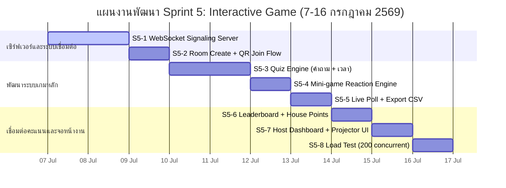

# Sprint 05: Multi-Interactive Game Session

**Goal:** พัฒนาระบบเกมแบบโต้ตอบเรียลไทม์ (Interactive Game Session) สำหรับจัดกิจกรรมในงานเลี้ยงสังสรรค์หรือสัมมนา เพื่อให้ทีมงานสร้างห้องเกมและให้ผู้ใช้อื่นๆ สแกนคิวอาร์โค้ดเข้าเล่นเกมตอบคำถาม (Quiz), โหวตความเห็น (Poll), และเกมวัดความเร็วการตอบสนอง (Reaction Game)
**Timeline:** 2026-07-07 → 2026-07-16 (10 วัน)
**Version:** 1.0 | **Last Updated:** 2026-06-18
**Status:** 📋 Planned (วางแผน)

---

## 📅 Internal Timeline (Gantt Chart)

---

## 📋 Committed Stories & Tasks

| ID | Story / Task | Owner | Estimate | Status |
| :--- | :--- | :--- | :--- | :--- |
| **[US-GAME-18a](../user-stories/archives/US-GAME-18a.md)** | **Staff สร้างห้องเกม (Game Room)** - สร้าง Room Code 6 หลัก และหน้าจอจัดการของ Host | Developer | 12 hrs | [x] (OX MVP) |
| **[US-GAME-18b](../user-stories/archives/US-GAME-18b.md)** | **ผู้เข้าร่วม Join ด้วย QR หรือ Room Code** - ตั้งชื่อเล่น/เข้าร่วมโดยไม่ต้องลงชื่อเข้าใช้งานหลัก | Developer | 8 hrs | [x] (OX MVP) |
| **[US-GAME-18c](../user-stories/archives/US-GAME-18c.md)** | **Host เห็นรายชื่อผู้เข้าร่วมแบบ Live Lobby** - หน้าจอรอล็อบบี้อัปเดตแบบเรียลไทม์ | Developer | 6 hrs | [x] (OX MVP) |
| **[US-GAME-18d](../user-stories/archives/US-GAME-18d.md)** | **Quiz — คำถามพร้อมนับถอยหลัง** - หน้าจอแสดงผลคำตอบและกราฟสถิติ | Developer | 16 hrs | [ ] |
| **[US-GAME-18e](../user-stories/archives/US-GAME-18e.md)** | **Mini-game — เกมกดปุ่มแข่งความเร็ว** - วัดเวลาตอบสนองในระดับมิลลิวินาที (ms) | Developer | 10 hrs | [ ] |
| **[US-GAME-18f](../user-stories/archives/US-GAME-18f.md)** | **Live Poll — โหวตเรียลไทม์พร้อมส่งออก** - สร้างหน้าโหวต กราฟเปรียบเทียบ และปุ่มส่งออก CSV | Developer | 10 hrs | [ ] |
| **[US-GAME-18g](../user-stories/archives/US-GAME-18g.md)** | **Leaderboard แสดงคะแนนและสรุปผล** - ตารางแสดงคะแนนพร้อมการจัดอันดับสะสมข้ามรอบ | Developer | 8 hrs | [x] (OX MVP) |
| **[US-GAME-18h](../user-stories/archives/US-GAME-18h.md)** | **เชื่อมคะแนนเกมเข้าสู่ระบบ House Points** - ตรวจสอบและให้สิทธิ์ผู้ใช้ CMU เพื่อโอนคะแนนเข้าบอร์ดบ้าน | Developer | 10 hrs | [ ] |
| **[US-GAME-18i](../user-stories/archives/US-GAME-18i.md)** | **ระบบแอดมินปิดห้องเกมเมื่อจบเกม** - บันทึกผลเกมไว้ฝั่งเซิร์ฟเวอร์ก่อนตัดการเชื่อมต่อ | Developer | 6 hrs | [x] (OX MVP) |

---

## 🛠 Sprint Specifics

### Tasks Breakdown (รายละเอียดงานย่อย)

*   **S5-1: WebSocket Signaling Server**
    *   ติดตั้งและกำหนดค่าเซิร์ฟเวอร์ Socket.IO แยกเป็น Standalone Node Server เพื่อป้องกัน Next.js App Router บล็อกพอร์ตและรองรับการเก็บหน่วยความจำชั่วคราว
    *   เชื่อมสแต็กเข้าไปยัง `docker-compose.yml` ภายใต้ชื่อบริการ `socket-server`
*   **S5-2: Room Create + QR Join Flow**
    *   สร้างระบบสร้างสุ่มคีย์ห้อง 6 หลัก พร้อมระบบคิวอาร์สำหรับการสแกนเชื่อมโยงไปหน้าล็อบบี้
    *   ระบบเก็บข้อมูลห้องชั่วคราวโดยประยุกต์ใช้ In-memory Store หรือเชื่อมต่อ Redis
*   **S5-3: Quiz Engine (ระบบคำถามและนับเวลา)**
    *   ตั้งค่าตัวนับเวลา (Countdown Timer) บังคับให้อยู่ภายใต้เซิร์ฟเวอร์เป็นศูนย์กลางการอ้างอิงเพื่อป้องกันการแฮกเวลา
    *   คำนวณคะแนนผู้ตอบตามสูตร: `คะแนน = (ความถูกต้องของคำตอบ) * (เวลาที่ตอบเร็วที่สุดที่บันทึกบน Server)`
*   **S5-4: Mini-game Reaction Engine (เกมวัดความเร็ว)**
    *   ทำระบบกระจายสัญญาณ "GO!" ไปให้ผู้เล่นทุกคนพร้อมกัน แล้วจัดเก็บประวัติ Timestamp ที่เกิดการกด Tap ส่งกลับเซิร์ฟเวอร์
    *   ทดสอบระบบเครือข่ายและความล่าช้า (Network latency) ภายใต้เครือข่ายไร้สาย 4G/WiFi
*   **S5-5: Live Poll + Export CSV**
    *   พัฒนาให้ผู้ใช้ส่งผลโหวตและคำนวณแอนิเมชันความคืบหน้าแบบสด (Real-time chart)
    *   ทำปุ่มดึงรายงานผลโหวตเป็นไฟล์ `.csv` สำหรับแอดมินนำไปวิเคราะห์ต่อ
*   **S5-6: Leaderboard + House Points Connection**
    *   ระบบตรวจสอบบัญชีลงท้ายด้วย `@cmu.ac.th` เพื่อนำคะแนนผลลัพธ์จากเกมไปคำนวณสะสมร่วมกับคะแนนระบบบ้านและเขียนบันทึกประวัติความปลอดภัยใน `auditLogs`
*   **S5-7: Host Dashboard & Projector View**
    *   ออกแบบหน้าเว็บสำหรับ Host ฉายจอโปรเจกเตอร์ใหญ่ขนาด 1080p ที่แสดงอันดับ แอนิเมชันแสดงผู้เล่นสไลด์สลับตำแหน่ง และบาร์คิวอาร์โค้ดชัดเจน
*   **S5-8: Load Test (200 concurrent)**
    *   จำลองการสแปมข้อความและจำนวนผู้ใช้เข้าสู่ระบบพร้อมกัน 200 ยูสเซอร์ด้วยเครื่องมือ `k6` หรือ `artillery` เพื่อดูความเสถียรและท่อเชื่อมข้อมูล WebSocket

### Definition of Done (เกณฑ์ความสำเร็จ)
1.  Host สามารถเปิดสร้างห้องผ่าน Dashboard แอดมินได้โดยตรง
2.  ผู้ใช้ 200 ยูสเซอร์สามารถล็อกเข้าห้องพร้อมกันและเล่นผ่านหน้าจอมือถือได้โดยไม่หลุดการเชื่อมต่อ
3.  แสดงกราฟผลโหวต คะแนนควิซ และเวลาตอบสนองในโหมดเรียลไทม์ได้อย่างลื่นไหล (Latency การกดตอบกลับมาถึงระบบ < 500ms)
4.  การแอดคะแนนเข้าบ้านคำนวณถูกต้องและถูกบันทึกลง Audit Logs ครบถ้วน
5.  สคริปต์โหลดเทสเสร็จสิ้นโดยมี Error Rate ต่ำกว่า 1%

---

## 🔗 Related Documents
- Product Backlog: [Product Backlog](../01-product-backlog.md)
- Sprint Planning Roadmap: [Sprint Planning](../02-sprint-planning.md)
- System Design: [System Design](../../software/01-system-design.md)
