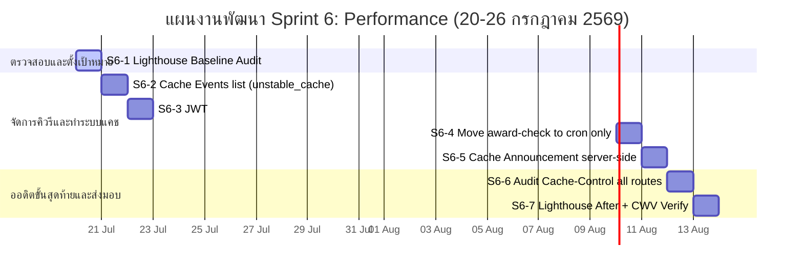

# Sprint 06: Performance & API Cache Optimization

**Goal:** ลดการส่ง Query ไปยังฐานข้อมูลลงในทุกจุดที่สำคัญ (Hot-paths) เพื่อลดภาระเครื่องเซิร์ฟเวอร์, เปิดระบบแคชระดับเซิร์ฟเวอร์ (unstable_cache) และปรับปรุงหัวข้อ Core Web Vitals (LCP, CLS, INP) ให้ทำงานได้เร็วตามเกณฑ์ Lighthouse
**Timeline:** 2026-07-20 → 2026-07-26 (7 วัน)
**Version:** 1.0 | **Last Updated:** 2026-06-18
**Status:** 📋 Planned (วางแผน)

---

## 📅 Internal Timeline (Gantt Chart)

---

## 📋 Committed Stories & Tasks

| ID | Story / Task | Owner | Estimate | Status |
| :--- | :--- | :--- | :--- | :--- |
| **[US-OPT-19a](../user-stories/archives/US-OPT-19a.md)** | **แยกข้อมูลกิจกรรมเป็นแบบ Static และ Per-user** - เพิ่มระบบแคชครอบข้อมูลกิจกรรมกลางด้วย `unstable_cache` | Developer | 10 hrs | [ ] |
| **[US-OPT-19b](../user-stories/archives/US-OPT-19b.md)** | **เก็บข้อมูลสาขา (major) ของผู้ใช้ใน Session** - ลดทอนการเขียนคิวรี่หาข้อมูลผู้ใช้ในหน้า API ร้องขอทั่วไป | Developer | 6 hrs | [ ] |
| **[US-OPT-19c](../user-stories/archives/US-OPT-19c.md)** | **ตัดฟังก์ชัน checkAndAwardClosedForms ออกจาก API บอร์ดบ้าน** - ย้ายภาระงานตรวจสอบฟอร์มปิดไปยัง Cron Job ทุก 5 นาที | Developer | 6 hrs | [ ] |
| **[US-OPT-19d](../user-stories/archives/US-OPT-19d.md)** | **ทำแคชให้ประกาศแดชบอร์ด (Announcement Caching)** - นำเอาตัวควบคุม Pre-fetch ฝั่งเซิร์ฟเวอร์มาใช้ตัด Polling | Developer | 8 hrs | [ ] |
| **[US-OPT-19e](../user-stories/archives/US-OPT-19e.md)** | **จัดการ Cache-Control Headers ให้ครบทุก API Route** - ตรวจเช็กและป้อนค่า header ให้เหมาะสมกับระดับความเป็นส่วนตัวข้อมูล | Developer | 8 hrs | [ ] |
| **[US-OPT-19f](../user-stories/archives/US-OPT-19f.md)** | **วัดผล Lighthouse Score และตรวจสอบความเสถียร** - บันทึกเปรียบเทียบค่าความเร็ว ก่อนทำ และ หลังทำระบบแคช | Developer | 8 hrs | [ ] |

---

## 🛠 Sprint Specifics

### Tasks Breakdown (รายละเอียดงานย่อย)

*   **S6-1: Lighthouse Baseline Audit**
    *   รันโปรแกรม Lighthouse และตรวจสอบความเร็วหน้าระบบแดชบอร์ดนิสิตนักศึกษาและหน้าล็อกอิน บันทึกค่าคะแนนในรูปของ LCP, INP, CLS ก่อนเริ่มทำระบบ
*   **S6-2: Cache Events list**
    *   ปรับปรุง API `/api/events` โดยการแยกข้อมูลรายการกิจกรรม (Static) ออกจากสถานะลงทะเบียนรายบุคคล (Dynamic)
    *   ใช้ Next.js `unstable_cache` ครอบข้อมูลรายการกิจกรรมหลัก ตั้งชื่อแท็กล้างข้อมูลเป็น `"events"` 
    *   แทรกฟังก์ชัน `revalidateTag("events")` ในหน้าแอดมินแก้ไขข้อมูลกิจกรรมเพื่อให้อัปเดตข้อมูลสดเสมอ
*   **S6-3: JWT major field**
    *   ปรับแก้การเข้ารหัส NextAuth callback ให้นำฟิลด์ `major` เก็บรวมไว้ใน Payload ของ Web Session JWT Cookie
    *   สแกนลบโค้ดที่มีการสั่ง `db.query.users.findFirst({ columns: { major } })` ในหน้าดึงข้อมูลต่างๆ ออกทั้งหมด
*   **S6-4: Move award-check to cron**
    *   ลบฟังก์ชันเช็คการให้คะแนนบ้านหลังฟอร์มปิด `checkAndAwardClosedForms()` ออกจาก API หน้าบอร์ดบ้าน `/api/houses`
    *   ปรับปรุงและกำหนดความครอบคลุมให้ระบบ Cron Job ใน `/api/cron/award-points/route.ts` มารับหน้าที่หลักในการทำงานทุก 5 นาทีแทน
*   **S6-5: Server-side Announcement**
    *   ย้ายการดึงข้อมูล Singleton แบนเนอร์ประกาศ จากเดิมเป็น Client-side Polling ไปเป็น Server-side Pre-fetch ในหน้า `app/dashboard/page.tsx`
    *   สร้างการแคชข้อมูลประกาศผ่าน `unstable_cache` ตั้งชื่อแท็กการล้างข้อมูลเป็น `"announcement"` 
*   **S6-6: Cache-Control Audit**
    *   รันโค้ดสแกนหาหน้า API ทุกจุดเพื่อตรวจสอบหัวข้อ Headers ของ `Cache-Control`
    *   ข้อมูลสาธารณะเช่นรายชื่อบ้าน: `public, s-maxage=30, stale-while-revalidate=60`
    *   ข้อมูลส่วนตัวเช่นคะแนนสะสมนิสิต: `private, no-store`
*   **S6-7: Lighthouse After + CWV Verify**
    *   ทำการวัดความเร็วซ้ำหลังกระบวนการเสร็จสิ้น เพื่อเช็คค่าเปรียบเทียบโดยมีเป้าหมายคือ LCP ≤ 2.5s, CLS ≤ 0.1 บนหน้าจอมือถือ

### Definition of Done (เกณฑ์ความสำเร็จ)
1.  ความเร็วการตอบกลับของ API `/api/events` ต้องเร็วขึ้นกว่าเดิมไม่น้อยกว่า 40% เมื่อดึงข้อมูลที่ติดแคช (Cache Hit)
2.  จำนวนคิวรีฐานข้อมูลในหน้ารายการกิจกรรมลดลงเหลือไม่เกิน 3 คิวรีต่อ Request
3.  หน้าของบอร์ดบ้านไม่รันประมวลผลคำนวณคะแนนฟอร์มปิดเบื้องหลัง
4.  Lighthouse Score ฝั่ง Mobile Performance ผ่านเกณฑ์การประเมิน ≥ 85 คะแนน

---

## 🔗 Related Documents
- Product Backlog: [Product Backlog](../01-product-backlog.md)
- Sprint Planning Roadmap: [Sprint Planning](../02-sprint-planning.md)
- System Design: [System Design](../../software/01-system-design.md)
