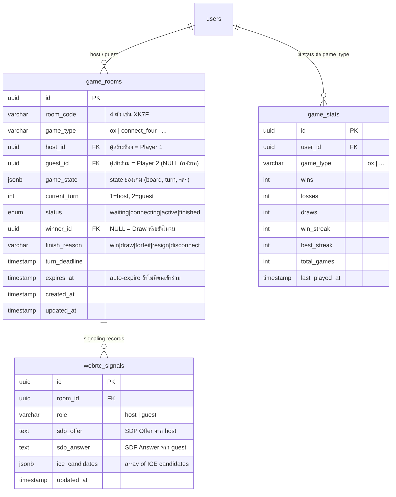

# ActiveCAMT P2P Battle — Game Platform Concept & Architecture

**Version:** 2.0 | **Last Updated:** 2026-06-24 | **Owner:** Developer  
**Sprint:** [Sprint 05 Backlog](../agile/sprint-backlogs/sprint-05.md)

---

## 1. บทนำ (Introduction)

### Elevator Pitch

**ActiveCAMT P2P Battle** คือแพลตฟอร์มเกมแข่งขันแบบ P2P (Player vs Player) สำหรับนักศึกษา CAMT ที่ออกแบบให้รองรับ **เกม Turn-based หลายรูปแบบ** บนโครงสร้างเดียวกัน ผู้เล่นเข้าร่วมเกมได้ทันทีด้วยการสแกน QR Code หรือพิมพ์รหัสห้อง 4 ตัวอักษร และใช้ **WebRTC Data Channel** เพื่อส่งข้อมูล Move แบบ P2P โดยตรงระหว่างสองเบราว์เซอร์ ไม่ผ่านเซิร์ฟเวอร์ในขณะเล่น

**เกมแรก:** [OX (Tic-Tac-Toe)](./games/ox.md) — ใช้เป็น MVP เพื่อทดสอบและพัฒนาโครงสร้างแพลตฟอร์ม

### Design Philosophy (3 หลักการ)

| หลักการ | คำอธิบาย |
|---|---|
| **QR-first Entry** | เข้าเกมด้วยการสแกน QR Code ต่อยอดจากระบบ QR ที่มีใน ActiveCAMT — ไม่ต้องค้นหาเพื่อนด้วยชื่อ |
| **WebRTC P2P** | Game moves ส่งตรง browser-to-browser ผ่าน RTCDataChannel — latency ต่ำ ไม่กดดัน server |
| **Extensible Game Modules** | แพลตฟอร์มแยกออกจาก game logic ชัดเจน — เพิ่มเกมใหม่โดยไม่ต้องแก้โครงสร้างหลัก |

### กลุ่มเป้าหมาย (Target Audience)

| กลุ่ม | รายละเอียด |
|---|---|
| **นักศึกษา CAMT** | ผู้ใช้หลัก — เข้าสู่ระบบด้วย Google `@cmu.ac.th` ผ่าน ActiveCAMT |
| **อายุ** | 18–25 ปี (นักศึกษาระดับปริญญาตรี–โท) |
| **Context การเล่น** | เล่นกันในงานกิจกรรม, ระหว่างพัก, อยู่บนเครือข่าย WiFi มหาวิทยาลัยเดียวกัน |
| **อุปกรณ์** | สมาร์ทโฟน (Mobile-first) และ Desktop |

---

## 2. Technical Stack

| Layer | Technology | หมายเหตุ |
|---|---|---|
| **Framework** | Next.js 16 (App Router) | เหมือนกับ ActiveCAMT หลัก |
| **Frontend** | React 19 + TypeScript + Tailwind CSS v4 | ไม่ต้องติดตั้งเพิ่ม |
| **Database** | PostgreSQL + Drizzle ORM | เพิ่มตาราง platform + stats |
| **Auth** | NextAuth v5 (session เดิม) | ใช้ user session ที่มีอยู่ |
| **P2P Connection** | WebRTC (RTCPeerConnection + RTCDataChannel) | เนทีฟใน Browser — ไม่ต้องติดตั้ง |
| **WebRTC Signaling** | REST API (Offer/Answer/ICE via DB) | Polling-based signaling เหมือนระบบ notification เดิม |
| **STUN Server** | `stun:stun.l.google.com:19302` | ฟรี — สำหรับ NAT traversal |
| **QR Code** | `html5-qrcode` (มีอยู่แล้ว) + `qrcode` (สร้าง QR) | ต่อยอดจาก QR scanner เดิม |
| **Timer Logic** | Server-side Timestamp | ป้องกัน client-side cheating |
| **Hosting** | Vercel + Supabase (เหมือนเดิม) | ไม่มีค่าใช้จ่ายเพิ่ม |

> **หมายเหตุ TURN Server:** v1.0 ไม่รวม TURN Server เนื่องจากผู้เล่นส่วนใหญ่อยู่บน WiFi มหาวิทยาลัยเดียวกัน (same network → STUN เพียงพอ) กรณีเล่นข้ามเครือข่าย (4G vs WiFi) อาจต้องเพิ่ม TURN ใน v2.0

---

## 3. Platform Architecture (ชั้นสถาปัตยกรรม)

```
┌─────────────────────────────────────────────────────────┐
│                 ActiveCAMT P2P Battle Platform           │
│                                                         │
│  ┌─────────────────────────────────────────────────┐   │
│  │             Game Modules (เกมที่รองรับ)           │   │
│  │  ┌──────────┐  ┌────────────┐  ┌─────────────┐  │   │
│  │  │ OX (v1.0)│  │ Future #2  │  │ Future #3   │  │   │
│  │  └──────────┘  └────────────┘  └─────────────┘  │   │
│  └─────────────────────────────────────────────────┘   │
│                          │                              │
│  ┌─────────────────────────────────────────────────┐   │
│  │              Game Platform Layer                  │   │
│  │  Turn Manager │ Timer System │ Result Persistence │   │
│  └─────────────────────────────────────────────────┘   │
│                          │                              │
│  ┌─────────────────────────────────────────────────┐   │
│  │           WebRTC Connection Layer                 │   │
│  │  Room Manager │ QR/Code Entry │ Signaling API    │   │
│  └─────────────────────────────────────────────────┘   │
│                          │                              │
│  ┌─────────────────────────────────────────────────┐   │
│  │           ActiveCAMT Foundation                  │   │
│  │  NextAuth v5 │ PostgreSQL │ Drizzle ORM          │   │
│  └─────────────────────────────────────────────────┘   │
└─────────────────────────────────────────────────────────┘
```

---

## 4. วิธีเข้าร่วมเกม (Connection Methods)

### 4.1 ภาพรวม — สองวิธีเข้าห้อง

```
HOST (สร้างห้อง)                    GUEST (เข้าร่วม)
       │                                    │
       ▼                                    │
  สร้างห้องเกม                     ┌────────┴──────────┐
  ได้รับ:                          │                   │
  • QR Code (ภาพ)         วิธีที่ 1: สแกน QR   วิธีที่ 2: พิมพ์รหัส
  • Room Code "XK7F"      ด้วยมือถือ            4 ตัวอักษร
  • Link URL                      │                   │
       │                          └────────┬──────────┘
       │                                   ▼
       │                          เข้าหน้า Join Game
       │◄──────────────────────── WebRTC Signaling
       │──────────────────────────────────►│
       │        P2P Data Channel           │
       └───────────────── ─ ─ ─ ─ ─ ─ ─ ─┘
                    (เล่นเกมโดยตรง)
```

### 4.2 Room Code Format

- **ความยาว:** 4 ตัวอักษร (A–Z, 0–9) เช่น `XK7F`, `3BQA`
- **Unique:** ในช่วงเวลาที่ห้องยัง active อยู่
- **Case-insensitive:** ผู้เล่นพิมพ์ `xk7f` หรือ `XK7F` ได้เหมือนกัน
- **Expiry:** ห้องที่ไม่มีผู้เข้าร่วมภายใน 10 นาที ถูก expire อัตโนมัติ

### 4.3 QR Code Content

QR Code ที่สร้างมีเนื้อหาเป็น URL:
```
https://[domain]/battle/join?room=XK7F
```
เมื่อสแกน → Redirect ไปหน้า Join โดยกรอก Room Code ล่วงหน้า

---

## 5. Game Registry (เกมที่รองรับบนแพลตฟอร์ม)

| Game ID | ชื่อเกม | สถานะ | เอกสาร |
|---|---|---|---|
| `ox` | OX (Tic-Tac-Toe) | v1.0 — MVP | [games/ox.md](./games/ox.md) |
| *(future)* | Connect Four | Planned | — |
| *(future)* | Rock-Paper-Scissors (Best of 3) | Planned | — |

**Game Module Interface** — เกมใหม่ต้อง implement:
```typescript
interface GameModule {
  gameId: string                           // ระบุชนิดเกม
  initialState(): GameState                // state เริ่มต้น
  validateMove(state: GameState, move: Move, playerId: string): boolean
  applyMove(state: GameState, move: Move): GameState
  checkResult(state: GameState): GameResult | null  // null = ยังเล่นอยู่
  renderBoard(state: GameState): React.ReactNode
}
```

---

## 6. Database Schema (Platform-level)



---

## 7. API Endpoints (Platform-level)

```
── Room Management ──────────────────────────────────────
POST   /api/battle/rooms                  ← สร้างห้องใหม่ + รับ room_code
GET    /api/battle/rooms/[code]           ← ตรวจสอบห้อง (ก่อน join)
POST   /api/battle/rooms/[code]/join      ← Guest เข้าร่วมห้อง

── WebRTC Signaling ─────────────────────────────────────
POST   /api/battle/rooms/[code]/signal    ← Host/Guest ส่ง SDP + ICE
GET    /api/battle/rooms/[code]/signal    ← Poll สัญญาณ (polling ทุก 1 วินาที)

── Game Actions ─────────────────────────────────────────
POST   /api/battle/rooms/[code]/move      ← ส่ง move (ยืนยันกับ server)
POST   /api/battle/rooms/[code]/resign    ← ยอมแพ้
GET    /api/battle/rooms/[code]/state     ← Fallback poll (ถ้า WebRTC หลุด)

── Stats & Leaderboard ──────────────────────────────────
GET    /api/battle/leaderboard?game=ox    ← ตารางอันดับ per game
GET    /api/battle/history                ← ประวัติการแข่งขัน
GET    /api/battle/stats/me               ← สถิติของผู้เล่นตัวเอง
```

---

## 8. Screen Map (ผังหน้าจอ Platform)

```
/battle                      ← Platform Hub (เลือกเกม, ดูสถิติ, ดู leaderboard)
/battle/create               ← เลือกชนิดเกม + สร้างห้อง (ได้ QR + Code)
/battle/join                 ← หน้าสแกน QR หรือพิมพ์รหัส
/battle/join?room=XK7F       ← หน้า join ที่กรอก code ล่วงหน้า (จาก QR scan)
/battle/room/[code]          ← หน้าเกม (Lobby → Active → Result)
/battle/leaderboard          ← ตารางอันดับ (filter per game)
/battle/history              ← ประวัติ W/L/D
```

---

## 9. Scope

### In Scope — v1.0

- WebRTC P2P Data Channel สำหรับ move transmission
- Signaling ผ่าน REST API polling
- QR Code entry + Room Code entry
- เกม OX (Tic-Tac-Toe) เป็น game module แรก
- Server-side turn timer + forfeit detection
- Stats และ Leaderboard แยกต่อชนิดเกม
- Fallback mode (polling) เมื่อ WebRTC ล้มเหลว
- Match history

### Out of Scope — v1.0

- ❌ TURN Server (รองรับ same-network เป็นหลัก)
- ❌ Spectator mode
- ❌ In-game chat
- ❌ AI opponent
- ❌ Tournament bracket
- ❌ การเชื่อมกับ House Points
- ❌ Guest play (ต้อง login ด้วย `@cmu.ac.th`)

---

## เอกสารที่เกี่ยวข้อง

- Platform Mechanics: [Platform Mechanics](./01-mechanics.md)
- เกม OX: [OX Game Design](./games/ox.md)
- Backlog: [Product Backlog](../agile/01-product-backlog.md)
- Sprint Plan: [Sprint 05 Backlog](../agile/sprint-backlogs/sprint-05.md)
- System Design: [System Design](../software/01-system-design.md)
- Data Schema: [Data Schema](../software/03-data-schema.md)
