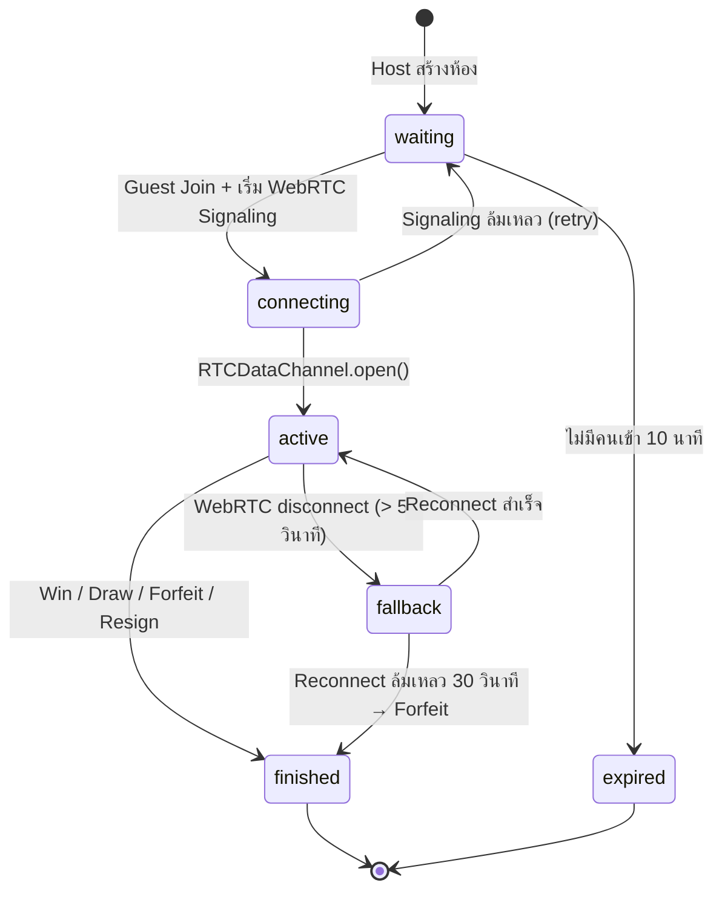
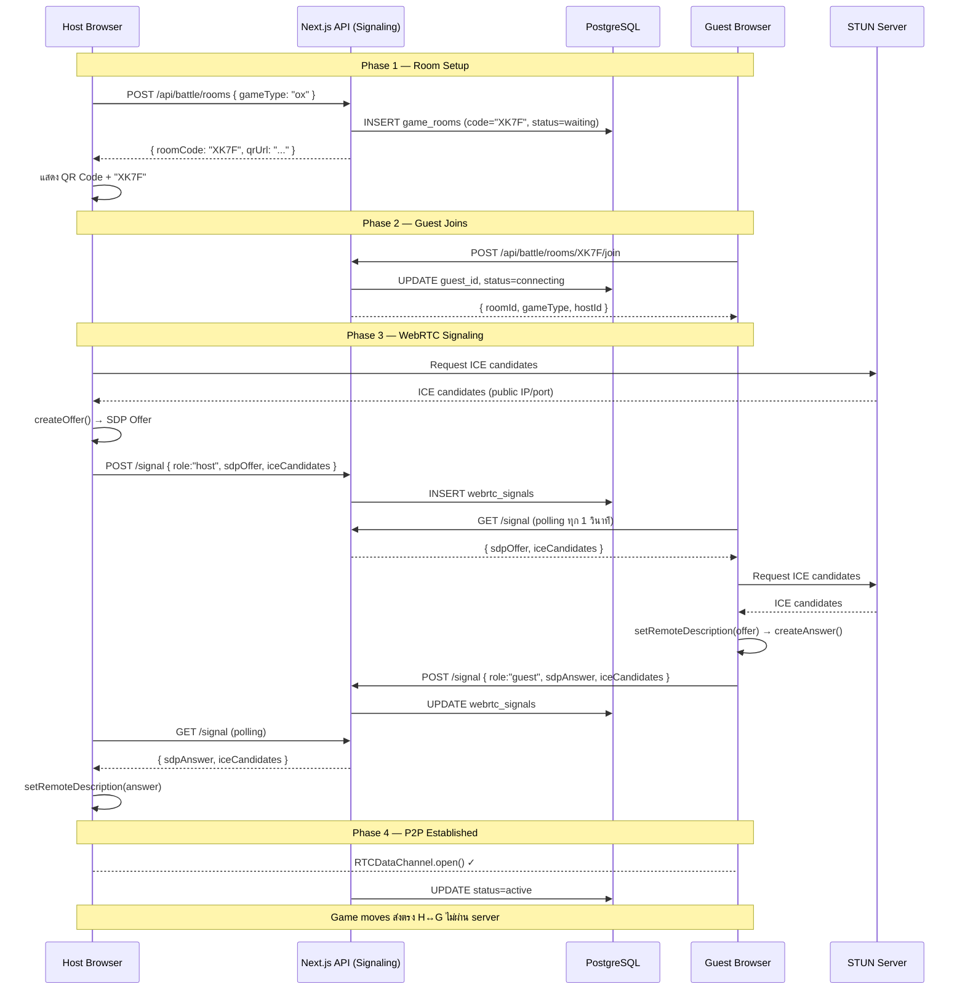
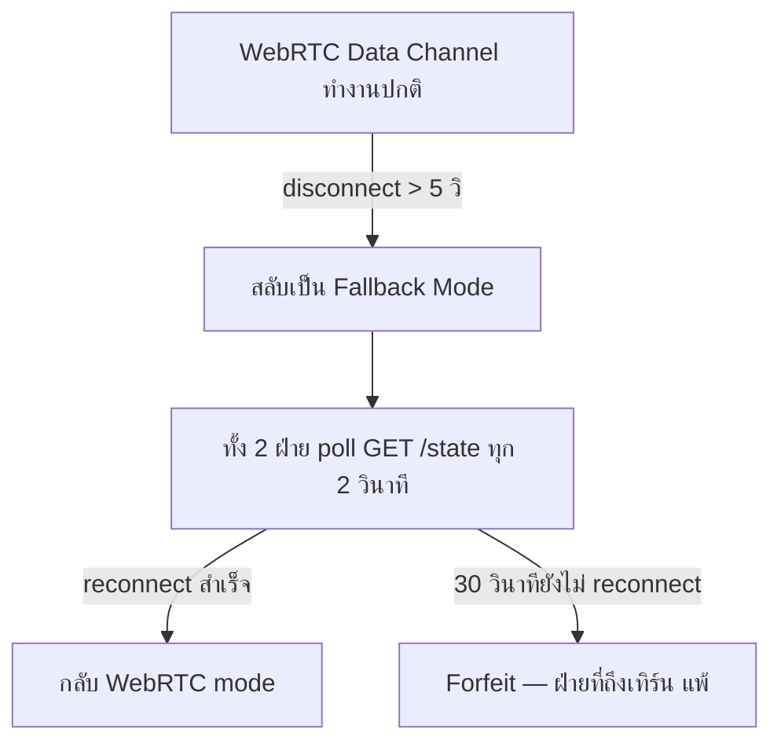

# ActiveCAMT P2P Battle — Platform Mechanics

**Version:** 2.0 | **Last Updated:** 2026-06-24  
**เชื่อมโยง:** [Platform Concept](./00-concept.md) | [OX Game Design](./games/ox.md) | [System Design](../software/01-system-design.md)

---

## 1. Core Platform Loop (วงจรหลักของแพลตฟอร์ม)

```
[Platform Hub /battle]
        │
        ▼
[สร้างห้อง /battle/create]
  เลือกชนิดเกม → ได้ QR Code + Room Code 4 หลัก
        │
        ▼
[รอ Guest เข้าร่วม — Lobby]
  Host แสดง QR + Code
  Guest สแกน QR หรือพิมพ์ Code ที่ /battle/join
        │
        ▼                    (ไม่มีคนเข้า 10 นาที → ห้อง expire)
[WebRTC Connecting]
  Signaling ผ่าน REST API
  ICE Candidate Exchange
  Data Channel สร้างเสร็จ
        │
        ▼
[Active Game]
  Move ส่งผ่าน WebRTC Data Channel (P2P)
  Move ยืนยันกับ Server ทุกครั้ง (anti-cheat)
  Timer นับที่ Server
        │
        ├── Win / Draw → [Result Screen]
        ├── Forfeit (timer หมด) → [Result Screen]
        ├── Resign → [Result Screen]
        └── Disconnect → Fallback polling → [Result Screen]
                │
                ▼
        [อัปเดต game_stats]
        [กลับ Platform Hub]
```

---

## 2. Room & Connection System

### 2.1 Room Lifecycle



### 2.2 Room Code Generation

```typescript
// สุ่ม Room Code 4 ตัว (A–Z, 0–9) — ตรวจว่าไม่ซ้ำกับห้อง active
function generateRoomCode(): string {
  const chars = 'ABCDEFGHJKLMNPQRSTUVWXYZ23456789' // ตัดตัวที่สับสน: 0,O,1,I
  return Array.from({ length: 4 }, () =>
    chars[Math.floor(Math.random() * chars.length)]
  ).join('')
}
```

---

## 3. WebRTC Connection Flow (ขั้นตอนการเชื่อมต่อ P2P)

### 3.1 ภาพรวม WebRTC Signaling ผ่าน REST



### 3.2 Message Protocol บน RTCDataChannel

ข้อมูลทุกชิ้นที่ส่งผ่าน Data Channel เป็น JSON string:

```typescript
// Move message (ผู้เล่นวางหมาก)
type MoveMessage = {
  type: 'move'
  playerId: string
  moveData: unknown        // game-specific (เช่น { cell: 5 } สำหรับ OX)
  timestamp: number        // client timestamp (ใช้แค่ UX — server timestamp เป็น authoritative)
  seq: number              // sequence number เพื่อตรวจ out-of-order
}

// Sync message (ขอ sync state เมื่อ reconnect)
type SyncMessage = {
  type: 'sync_request' | 'sync_response'
  gameState?: unknown
}

// Ping/Pong (ตรวจ connection health)
type PingMessage = { type: 'ping' | 'pong'; ts: number }
```

### 3.3 Hybrid Architecture (WebRTC + Server Confirm)

```
WebRTC Data Channel       Server API
(real-time UX)            (authoritative)

Player A
  │── move ──►──────────────────────────────────────┐
  │                                                  ▼
  │                                       POST /api/battle/.../move
  │                                       Server validates + stores
  │◄─── move echo ──────────────────────────────────┘
  │
  │── move ──►  Player B
               (immediate feedback via DataChannel)
```

- **DataChannel:** ส่ง move ให้ฝ่ายตรงข้ามเห็น UI ทันที (zero latency UX)
- **Server:** ยืนยัน move ทุกครั้ง (validate turn, validate move legality, update DB)
- หากทั้งสองไม่ตรงกัน → server เป็น authoritative, client sync ใหม่

---

## 4. Turn System (ระบบการสลับเทิร์น)

### 4.1 กฎทั่วไป (ใช้กับทุกเกม)

1. **Host** เสมอเป็น Player 1 (เริ่มเทิร์นแรก)
2. **Guest** เสมอเป็น Player 2
3. เทิร์นสลับสม่ำเสมอหลังทุก Move ที่ valid
4. `current_turn` ใน DB เป็น authoritative — client ต้องตรงกัน

### 4.2 Turn Validation (Server-side)

```typescript
// Server ตรวจทุกครั้งก่อน process move
function validateTurn(room: GameRoom, requesterId: string): boolean {
  if (room.current_turn === 1 && requesterId === room.host_id) return true
  if (room.current_turn === 2 && requesterId === room.guest_id) return true
  return false // ไม่ใช่เทิร์นของผู้เล่นคนนี้ → HTTP 403
}
```

---

## 5. Timer System (ระบบจับเวลา)

### 5.1 Flow

```
เริ่มเทิร์น (move สำเร็จ / เกมเริ่ม)
    │
    ▼
turn_deadline = NOW() + INTERVAL '60 seconds'  ← เขียนใน DB
    │
    ├── ผู้เล่นส่ง Move ก่อนหมดเวลา
    │       → อัปเดต board, สลับเทิร์น, ตั้ง turn_deadline ใหม่
    │
    └── ไม่มี Move จนหมดเวลา
            → ตรวจพบเมื่อ: GET /state poll หรือ POST /move ครั้งถัดไป
            → Server: status=finished, finish_reason=forfeit
                       winner_id = ฝ่ายตรงข้าม
```

**ข้อดี Lazy Evaluation:** ไม่ต้องใช้ Cron Job — forfeit detection เกิดขึ้น on-demand เมื่อมี request

### 5.2 Client-side Timer Display

- Client แสดง countdown จาก `turn_deadline` (ดึงมาจาก API)
- นาฬิกา client อาจเร็ว/ช้ากว่า server เล็กน้อย — ใช้แค่แสดง UX
- Server เป็น authoritative เสมอ

---

## 6. Fallback Mode (กรณี WebRTC หลุด)



- Client ตรวจ `dataChannel.readyState !== 'open'` → เข้า fallback อัตโนมัติ
- Fallback ใช้ REST polling เหมือนกับระบบ notification เดิม — ไม่ต้องพัฒนาเพิ่ม

---

## 7. Result & Stats Persistence

### 7.1 เมื่อเกมจบ (finish_reason ใดก็ตาม)

```typescript
// ทำใน DB Transaction เดียวกัน
async function finalizeGame(roomId: string, result: GameResult) {
  await db.transaction(async (tx) => {
    // 1. อัปเดต room status
    await tx.update(gameRooms).set({
      status: 'finished',
      winner_id: result.winnerId,
      finish_reason: result.reason,
    }).where(eq(gameRooms.id, roomId))

    // 2. อัปเดต stats ทั้ง 2 ฝ่าย
    await updateStats(tx, result.winnerId, 'win')
    await updateStats(tx, result.loserId, 'lose')
    // หรือ draw ทั้งคู่
  })
}
```

### 7.2 Stats Update Rules

| ผลการแข่ง | ผู้ชนะ | ผู้แพ้ |
|---|---|---|
| **win / forfeit / resign / disconnect** | wins+1, win_streak+1, best_streak update | losses+1, win_streak=0 |
| **draw** | draws+1, win_streak ไม่เปลี่ยน | draws+1, win_streak ไม่เปลี่ยน |
| **ทั้งคู่** | total_games+1, last_played_at=now | total_games+1, last_played_at=now |

---

## 8. Game Module Contract (Interface สำหรับเกมใหม่)

เกมทุกตัวต้อง export object ที่ตรงตาม interface นี้:

```typescript
interface GameModule<TState, TMove> {
  // Metadata
  gameId: string
  displayName: string
  minPlayers: 2
  maxPlayers: 2

  // State Management
  initialState(): TState
  validateMove(state: TState, move: TMove, currentTurn: 1 | 2): boolean
  applyMove(state: TState, move: TMove, currentTurn: 1 | 2): TState

  // Result Detection
  checkResult(state: TState): {
    status: 'ongoing' | 'win' | 'draw'
    winner?: 1 | 2        // 1 = host, 2 = guest
  }

  // UI (React Component)
  BoardComponent: React.FC<{
    state: TState
    currentTurn: 1 | 2
    myTurn: boolean
    onMove: (move: TMove) => void
  }>
}
```

**ตัวอย่าง OX Game Module:** → ดูรายละเอียดที่ [games/ox.md](./games/ox.md)

---

## เอกสารที่เกี่ยวข้อง

- Concept: [Platform Concept](./00-concept.md)
- OX Game: [OX Game Design](./games/ox.md)
- Backlog: [Product Backlog](../agile/01-product-backlog.md)
- Data Schema: [Data Schema](../software/03-data-schema.md)
