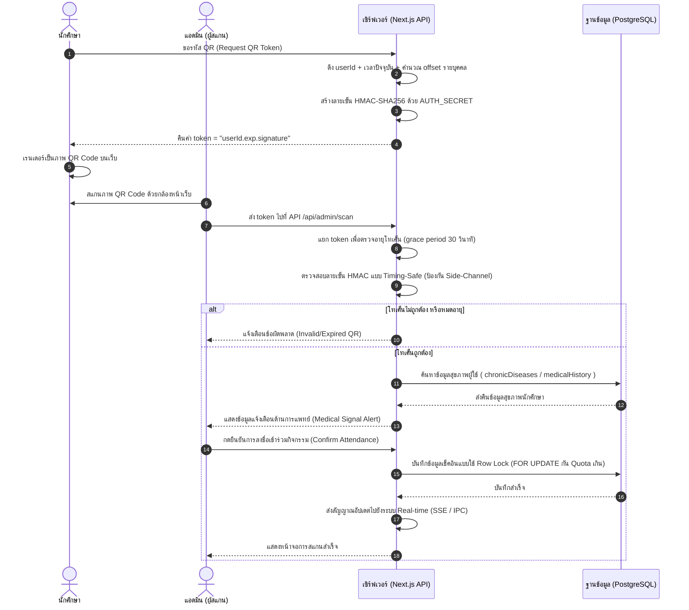
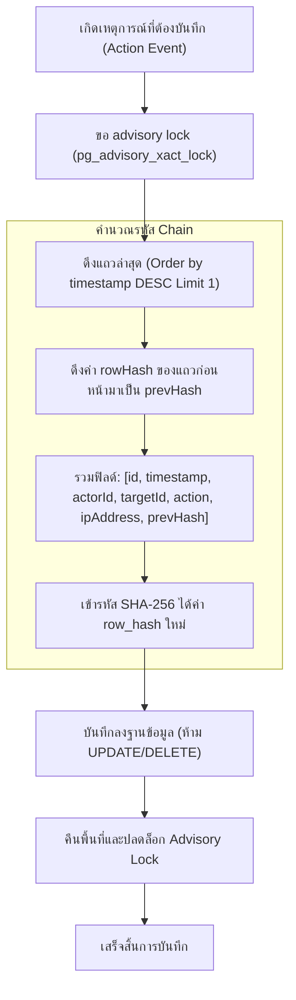
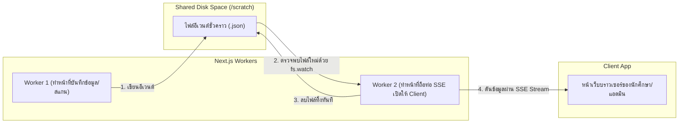
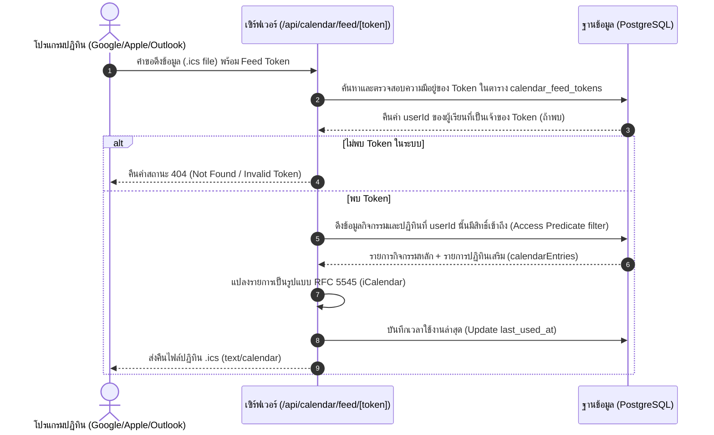
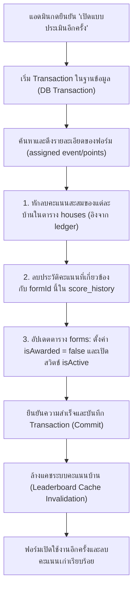

# 💻 ActiveCAMT — แผนผังการไหลของข้อมูลและโมดูล (Process Flows & Architecture Diagrams)

**เวอร์ชัน:** 1.0 | **อัปเดตล่าสุด:** 2026-06-18  
**สถานะ:** เสร็จสมบูรณ์ (เวอร์ชัน 1.2)  
**ลิงก์ดัชนี:** [กลับหน้าหลัก](../index.md)

---

## 1. แผนผังการทำงานหลัก (System Process Flows)

### 1.1 ขั้นตอนการยืนยันตัวตนด้วย Secure QR (Secure QR Verification Flow)
แผนผังด้านล่างแสดงโครงสร้างการตรวจสอบคิวอาร์โค้ดของนักศึกษาโดยแอดมิน เพื่อความมั่นใจว่าคิวอาร์โค้ดนั้นปลอดภัยและเพิ่งสร้างขึ้นจริงภายใน 5 นาที:

---

### 1.2 การเขียนและเรียงห่วงโซ่ประวัติความปลอดภัย (Audit Log Hash Chaining Flow)
เพื่อป้องกันการลบหรือแก้ไขข้อมูลความปลอดภัยย้อนหลัง ล็อกจะถูกบันทึกร้อยเรียงต่อกันเป็น Hash Chain ดังนี้:

---

### 1.3 การสื่อสารแบบ Real-time ข้ามโปรเซส (SSE Cross-Process IPC)
ภาพแสดงการทำงานเมื่อ Next.js ทำงานแบบ Multi-worker หรือคลัสเตอร์ โดยสื่อสารระหว่างกันผ่านดิสก์แบบ Event Broker:

---

### 1.4 ขั้นตอนการสมัครรับข้อมูลปฏิทินด้วย .ics Feed (.ics Feed Subscription Flow)
แผนผังแสดงการดึงข้อมูลจากภายนอก (Google Calendar, Apple Calendar, Outlook) ผ่าน Token ปลอดภัย โดยจะข้าม Middleware การตรวจสอบสิทธิ์แบบดั้งเดิมของเว็บแอปเพื่อเปิดให้เข้าถึงไฟล์ปฏิทินได้:

---

### 1.5 ขั้นตอนการเปิดแบบประเมินอีกครั้งและการคืนคะแนน (Form Re-opening & Points Clawback Flow)
เมื่อแอดมินกดยืนยันให้เปิดทำแบบประเมินซ้ำ คะแนนที่บันทึกและแจกจ่ายไปแล้วจะถูกดึงคืนอย่างปลอดภัยผ่าน Transaction เพื่อป้องกันคะแนนผิดพลาด:

---

## 2. ความสัมพันธ์ระดับสถาปัตยกรรม (Module Interactions)
* **`auth.ts` -> `proxy.ts`**: Middleware กรองคำร้องขอและสิทธิ์ตั้งแต่ชั้นนอกสุดของระบบ โดยบทบาท SMO จะได้รับการคัดกรองให้เข้าชมได้เฉพาะหน้า `/admin/scanner` เท่านั้น
* **`scanner.service.ts` -> `audit.service.ts`**: เมื่อการยืนยันตัวตนสำเร็จ ระบบจะสั่งบันทึกการทำงานของแอดมินลงในบันทึกที่แก้ไขไม่ได้โดยอัตโนมัติ
* **`scanner.service.ts` -> `realtime-emitter.ts`**: ส่งสัญญาณข้อมูลกิจกรรมและการสแกนไปยังนักศึกษาและหน้าจอสรุปผลของแอดมินแบบทันที

---

## Related Documents
- [01-system-design.md](./01-system-design.md) — โครงสร้างระบบย่อยและการควบคุมสิทธิ์
- [03-data-schema.md](./03-data-schema.md) — โครงสร้างข้อมูลสคีมาฐานข้อมูล
