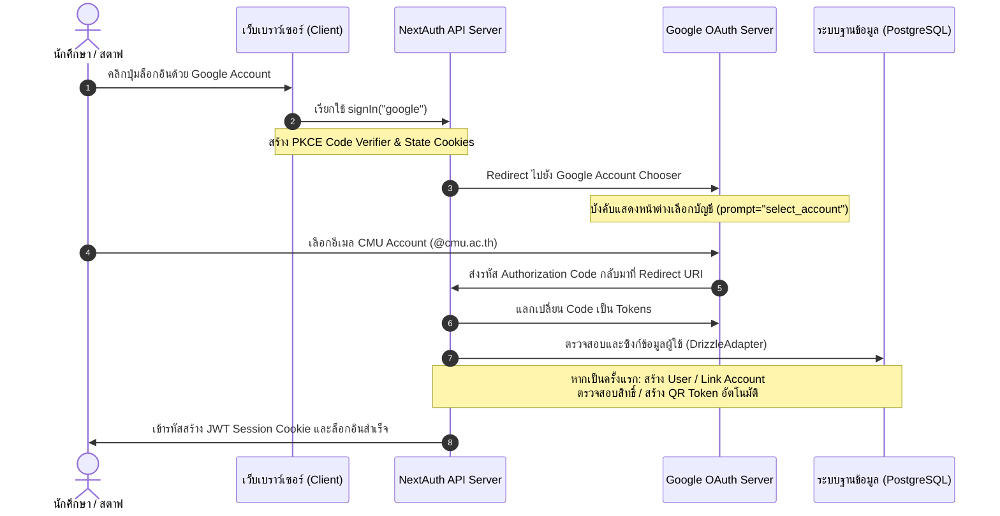

# 🔑 เอกสารถอดองค์ความรู้การพัฒนาระบบ Google OAuth (ActiveCAMT)
*วิเคราะห์และสรุปแนวปฏิบัติ (Best Practices) จากการใช้งาน NextAuth v5, Google Provider และ Drizzle ORM*

**เวอร์ชันเอกสาร:** 1.0 | **แก้ไขล่าสุด:** 2026-06-18  
**ผู้รวบรวม:** ฝ่ายเทคโนโลยีโครงการ ActiveCAMT  

---

## 🏗️ 1. ภาพรวมสถาปัตยกรรม (Architectural Overview)

ระบบลงทะเบียนและยืนยันตัวตนของ **ActiveCAMT** ใช้เฟรมเวิร์ก **NextAuth (Auth.js) v5 (Beta)** เป็นโครงสร้างหลัก ร่วมกับตัวจัดเก็บฐานข้อมูล **Drizzle ORM Adapter** และเปิดยืนยันตัวตนผ่านทาง **Google OAuth Provider**



---

## ⚙️ 2. การตั้งค่าสเปกการตั้งค่าหลัก (Core NextAuth Config)

การตั้งค่า NextAuth ในไฟล์ [auth.ts](../../../src/auth.ts) มีพารามิเตอร์เด่นที่เป็นประเด็นสำคัญในการรันในเครื่องและโปรดักชัน ดังนี้:

### 2.1 สิทธิพิเศษในการรันบน Self-hosted (`trustHost: true`)
```typescript
trustHost: true
```
*   **ทำไมต้องใช้:** สำหรับการ deploy บนเครื่องเซิร์ฟเวอร์เสมือน (VPS) หรือ Docker ที่ระบบเซิร์ฟเวอร์ไม่สามารถระบุโฮสต์และโดเมนได้เอง (Auto-detection failure) การตั้งค่านี้ช่วยสั่งให้ NextAuth เชื่อมประกอบ Callback URL อิงตาม headers จริงของ Host ที่เข้ามา ป้องกันปัญหาการแลกคีย์ PKCE พัง (Invalid Check / PKCE State mismatch)
*   **ข้อควรระวัง:** `AUTH_URL` ในไฟล์ `.env` ของโปรดักชันจำเป็นต้องระบุ URL เต็มให้ตรงกับโดเมนหลักอย่างแม่นยำ (เช่นมี `www` หรือไม่) และใน Google Cloud Console จะต้องชี้ URL ยืนยันกลับไปที่ `/api/auth/callback/google`

### 2.2 ป้องกันบั๊ก Multiple Accounts Race Condition
```typescript
Google({
  clientId: process.env.AUTH_GOOGLE_ID,
  clientSecret: process.env.AUTH_GOOGLE_SECRET,
  allowDangerousEmailAccountLinking: true,
  authorization: { params: { prompt: "select_account" } },
})
```
*   **`allowDangerousEmailAccountLinking: true`:** เปิดให้บัญชีอีเมลเดียวกันที่เคยล็อกอินผ่านช่องทางอื่นสามารถกดลิงก์บัญชีข้ามมาใช้ Google OAuth ได้โดยข้อมูลผู้ใช้ไม่เสียหาย (ในที่นี้ปลอดภัยเนื่องจากระบบจำกัดโดเมนล็อกอินผ่าน Google ช่องทางเดียว)
*   **`prompt: "select_account"` (สำคัญมาก ⚠️):** ในกรณีที่ผู้ใช้มีบัญชี Google บันทึกในเครื่องหลายบัญชี NextAuth อาจพยายามล็อกอินเงียบ (Silent Sign-in) ส่งผลให้คุกกี้ PKCE/State เก่าชนกันและหน้าเว็บขึ้นเอ็รเรอร์ *"Session Expired"* การบังคับแสดงกล่องเลือกบัญชีทุกครั้งช่วยการันตีการสร้างคู่คุกกี้ใหม่ที่ตรงกัน 100%

### 2.3 ปรับลดระยะเวลาถือคุกกี้ให้ปลอดภัย (Session Max Age)
```typescript
session: { strategy: "jwt", maxAge: 7 * 24 * 60 * 60 }
```
*   ระบบบีบอายุคุกกี้ JWT ให้มีเวลาใช้งานเพียง **7 วัน** (จากเดิมของ NextAuth คือ 30 วัน) เพื่อเพิ่มความปลอดภัยกรณีนักศึกษาใช้เครื่องส่วนรวมของมหาวิทยาลัย แต่ยังไม่สั้นจนต้องกดล็อกอินใหม่ทุกวันระหว่างจัดช่วงงาน

---

## 🔒 3. ด่านกรองและการปรับแต่งสิทธิ์ (Custom Security Callbacks)

### 3.1 ด่านคัดกรอง Domain (`signIn` Callback)
*   **การทำงาน:** ตรวจเช็คโดเมนอีเมลของผู้ใช้ในขั้นตอนแลกโทเค็นครั้งแรก โดยปกติจะล็อกในกูเกิลคอนโซลแล้ว แต่เพื่อความปลอดภัยขั้นสูงสุด ด่านนี้จะตรวจสอบอีเมลลงท้ายด้วย `@cmu.ac.th`
*   **Auto-Promote Super Admin:** หากอีเมลตรงกับรายการผู้ดูแลที่ตั้งไว้ในตัวแปรระบบ `SUPER_ADMIN_EMAILS` ระบบจะสั่งรัน SQL ไปแก้ไข Role ในตารางฐานข้อมูลให้เป็น `'super_admin'` ทันที
*   **Auto-Generate QR Token:** ตรวจสอบตารางหากเป็นผู้ใช้ล็อกอินใหม่ที่ยังไม่มีรหัส QR ประจำตัว ระบบจะสร้าง UUID ส่งเข้าไปบันทึกเตรียมการสแกนเช็คอิน

---

## ⚡ 4. การจัดการประสิทธิภาพแคชเซสชัน (Performance Optimization)

ในการพัฒนาระบบที่มีผู้ใช้ออนไลน์จำนวนมาก NextAuth มักก่อให้เกิดการดึงข้อมูลจาก Database ถี่เกินไป (ทุกๆ Request) ซึ่งทีมงานได้แก้ไขปัญหานี้อย่างเป็นระบบผ่านกลไกต่อไปนี้:

### 4.1 Periodic DB Refresh (รีเฟรชข้อมูลตามช่วงเวลา)
การดึงข้อมูลสิทธิ์และโปรไฟล์จริงจากตาราง `users` จะดำเนินการผ่านตัวตรวจเช็คเวลาแคชใน `jwt` callback:
```typescript
const DB_REFRESH_INTERVAL_MS = 2 * 60 * 1000; // 2 นาที
const lastRefresh = (token.lastDbRefresh as number) || 0;
const periodicDue = Date.now() - lastRefresh > DB_REFRESH_INTERVAL_MS;

if (userId && (profileIncomplete || periodicDue)) {
  const dbUser = await fetchUserDataFromDb(userId);
  if (dbUser) await applyDbUserToToken(token, dbUser, userId);
  token.lastDbRefresh = Date.now();
}
```
*   **ข้อดี:** ข้อมูลการเปลี่ยนแปลงสิทธิ์ (เช่น สต๊าฟแต่งตั้งนักศึกษาคนนี้เป็น Registration เพิ่มเติม) จะถูกดึงมาซิงก์ใหม่ทุกๆ 2 นาที โดยไม่ยิงคิวรี่ลงตารางฐานข้อมูลในทุกๆ API call
*   **การบันทึก:** คีย์ `lastDbRefresh` จะถูกเขียนและเก็บรวมเข้าไปในตัวคุกกี้เบราว์เซอร์โดยตรงเพื่อให้สิทธิคงอยู่แม้มีการเปลี่ยนหน้า

### 4.2 Eager Onboarding Refresh (แคชชะงักระหว่างกรอกข้อมูล)
*   เมื่อสมัครครั้งแรก ฟิลด์ `profileCompleted` จะมีสถานะเป็น `false` ทำให้ผู้ใช้ค้างที่หน้า Onboarding
*   หากใช้การจำกัดเวลา 2 นาที ผู้ใช้ที่กรอกประวัติเสร็จแล้วอาจต้องรอถึง 2 นาทีกว่าคุกกี้จะเปลี่ยนสถานะเป็นผ่านประวัติ
*   **วิธีแก้ปัญหา:** เพิ่มเงื่อนไข `profileIncomplete` (หากยังกรอกประวัติไม่เสร็จ จะยกเว้นระบบหน่วงเวลา 2 นาทีและดึงข้อมูลจาก DB ทุก Request) เพื่อความลื่นไหลในการใช้งาน และเมื่อกรอกข้อมูลเรียบร้อยระบบจะหยุดรันคิวรี่นี้ทันทีเพื่อกลับสู่รอบปกติ

### 4.3 Zero-DB Session Callback (ยกเว้น SQL ใน Session)
```typescript
async session({ session, token }) {
  // ดึงค่าอ้างอิงตรงมาจาก Token ที่ดึงข้อมูลฐานข้อมูลมาเรียบร้อยแล้วด้านบน
  session.user.role = token.role;
  session.user.houseId = token.houseId;
  ...
  return session;
}
```
*   **หลักการสำคัญ:** ภายในฟังก์ชัน `session` callback ห้ามเขียน SQL Query เด็ดขาด เนื่องจากขั้นตอนนี้จะทำงานทุกครั้งที่มีการเรียกใช้ Session บนเซิร์ฟเวอร์ การผูกสิทธิ์อ้างตรงจาก JWT token ที่ซิงก์เรียบร้อยแล้วในขั้นตอนที่ผ่านมาจะลดจำนวนคิวรีลงเป็นศูนย์ (Zero database query layout)

---

## 📝 5. ระบบบันทึกประวัติความปลอดภัย (Audit Logging)

การดำเนินงานล็อกอินของผู้ใช้ที่มีสิทธิ์ระดับควบคุมสูง (สตาฟ, แอดมิน, ผู้ลงทะเบียน) จะต้องได้รับการตรวจสอบได้:
*   การล็อกข้อมูลจะแยกไปผูกไว้ที่ `events.signIn` ของ NextAuth ซึ่งจะทำงานครั้งเดียวหลังกระบวนการล็อกอินและกูเกิลตอบรับแลกเปลี่ยนคีย์สำเร็จ
*   ดึงค่าไอพีแอดเดรสจริงของผู้ใช้จากตัวกรอง:
    ```typescript
    const h = await headers();
    const ipAddress = h.get("x-forwarded-for")?.split(",")[0]?.trim() || h.get("x-real-ip") || "unknown";
    ```
*   ส่งคำสั่งเขียนข้อมูลผ่าน `AuditService.logAction` และหุ้มกระบวนการด้วยชุดดักข้อผิดพลาด `try-catch` เพื่อไม่ให้ความเสียหายของตาราง Audit log ย้อนกลับไปขัดขวางกระบวนการล็อกอินหลักของผู้ใช้

---

## 💡 สรุปแนวทางสำหรับนักพัฒนา
1.  **รันระบบใน Docker/VPS:** ห้ามลืมประกาศ `trustHost: true` ในการกำหนดค่า
2.  **จัดการ Session:** ปรับแต่งข้อมูลให้ทำใน `jwt` callback แล้วดึงข้อมูลต่อใน `session` เพื่อไม่ให้หน้าเว็บช้าจากการเชื่อมฐานข้อมูลซ้ำซ้อน
3.  **ความปลอดภัยโดเมน:** เพิ่มการตรวจสอบประเภทโดเมนบน `signIn` callback ซ้ำเสมอแม้จะล็อกที่กูเกิลคอนโซลแล้ว
