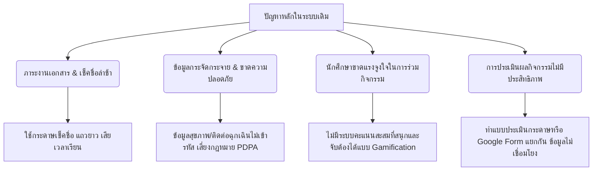
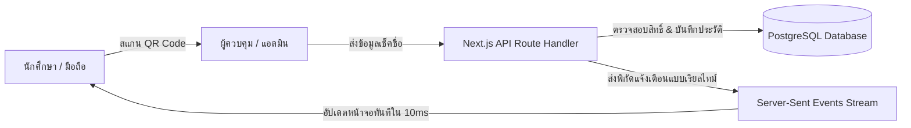

# เอกสารข้อเสนอโครงการขอรับทุนสนับสนุนเชิงยุทธศาสตร์ (Project Funding Proposal)

**ชื่อโครงการ:** แพลตฟอร์มบริหารจัดการกิจกรรมและการจัดสรรคะแนนบ้านดิจิทัลแบบเรียลไทม์ (ActiveCAMT: Real-Time Activity & Digital House Points Management Platform)  
**หน่วยงานที่เสนอโครงการ:** สโมสรนักศึกษาวิทยาลัยศิลปะ สื่อ และเทคโนโลยี  มหาวิทยาลัยเชียงใหม่  
**กลุ่มเป้าหมาย:** นักศึกษา อาจารย์ เจ้าหน้าที่กิจการนักศึกษา และผู้บริหารคณะวิชา  

---

## 1. บทสรุปผู้บริหาร (Executive Summary)

ในยุคปัจจุบันการพัฒนาทักษะของนักศึกษานอกห้องเรียน (Soft Skills) ผ่านการเข้าร่วมกิจกรรมมีความสำคัญไม่ยิ่งหย่อนไปกว่าวิชาการ ทว่าการบริหารจัดการกิจกรรมในสถาบันอุดมศึกษายังคงเผชิญความท้าทายจากกระบวนการทำงานแบบดั้งเดิม (Manual Processes) ที่มีความล่าช้า สูญเสียข้อมูลได้ง่าย และไม่สามารถกระตุ้นการมีส่วนร่วมของนักศึกษาได้อย่างเป็นรูปธรรม

โครงการ **ActiveCAMT** เป็นการพัฒนาแพลตฟอร์มเว็บและโมบายล์แอปพลิเคชันยุคใหม่ (Next-Gen Web & Mobile Application) ที่ทำงานบนสถาปัตยกรรมประสิทธิภาพสูง (Next.js 16 + React 19 + Tailwind v4 + Drizzle ORM) เพื่อปรับเปลี่ยนระบบทะเบียนกิจกรรม การตรวจสอบการเข้างานด้วยรหัส QR ความปลอดภัยสูง (Secure QR Code Scanning) ระบบการประเมินผลหลังจบกิจกรรมแบบไดนามิก และระบบเก็บคะแนนสะสมแยกตามกลุ่มสังเคราะห์ (House Points System) ให้เป็นแบบดิจิทัลร้อยเปอร์เซ็นต์ พร้อมแสดงผลคะแนนและตารางผู้นำ (Leaderboard) แบบเรียลไทม์ (Real-Time updates ผ่าน Server-Sent Events)

ด้วยงบประมาณการลงทุนในโครงสร้างพื้นฐานที่ต่ำมาก (ใช้งานบน Cloud VPS ขนาด 70GB ได้อย่างราบรื่นรองรับนักศึกษาได้มากกว่า 1,000 คนพร้อมกัน) แพลตฟอร์มนี้ไม่เพียงแต่จะช่วยลดภาระงานด้านเอกสารของเจ้าหน้าที่ลงกว่า 80% แต่ยังสร้างแรงจูงใจเชิงบวก (Gamification) ให้แก่นักศึกษาในการเข้าร่วมกิจกรรมพัฒนาตนเอง ส่งผลดีต่อตัวชี้วัดความสำเร็จของคณะวิชา (KPIs) และสามารถขยายผลใช้งานไปยังคณะอื่น ๆ ทั่วทั้งมหาวิทยาลัยได้อย่างง่ายดาย

---

## 2. ความเป็นมาและความสำคัญของปัญหา (Background & Problem Statement)

จากการวิเคราะห์การดำเนินงานด้านกิจการนักศึกษาในปัจจุบัน พบปัญหาสำคัญ 4 ประการที่ต้องการการแก้ไขอย่างเร่งด่วน:



1. **ความล่าช้าในขั้นตอนการลงทะเบียนและตรวจสอบการเข้าร่วม (Attendance Friction):** การใช้กระดาษลงชื่อหรือการสแกนบัตรนักศึกษาแบบเดิมก่อให้เกิดแถวคอยที่ยาวเหยียดในช่วงเริ่มกิจกรรม เสียเวลาของวิทยากรและนักศึกษา อีกทั้งยังมีช่องโหว่ในการลงชื่อแทนกัน
2. **การขาดระบบแรงจูงใจเชิงบวก (Lack of Engagement & Gamification):** นักศึกษาขาดความตื่นตัวในการเข้าร่วมกิจกรรมเนื่องจากคะแนนกิจกรรมถูกมองว่าเป็นเพียง "หน้าที่" ที่ต้องทำให้ครบตามเงื่อนไขการจบการศึกษา ขาดมิติความบันเทิงและการสร้างความสามัคคีร่วมกันเป็นกลุ่ม
3. **ความเสี่ยงด้านการรักษาความปลอดภัยของข้อมูลส่วนบุคคล (Data Privacy & PDPA Compliance):** ข้อมูลส่วนบุคคลที่สำคัญ เช่น ประวัติการรักษาพยาบาล โรคประจำตัว ยาที่แพ้ หรือข้อมูลผู้ติดต่อฉุกเฉินของนักศึกษา มักถูกจัดเก็บในรูปแบบเอกสารหรือแชร์ผ่านไฟล์ Excel ที่ไม่ปลอดภัย ซึ่งขัดต่อพระราชบัญญัติคุ้มครองข้อมูลส่วนบุคคล (PDPA)
4. **ความยุ่งยากในการติดตามและการประเมินผลกิจกรรม (Evaluation & Audit Bottleneck):** เจ้าหน้าที่ต้องใช้เวลาหลายสัปดาห์หลังจบกิจกรรมในการสรุปผลแบบประเมินความพึงพอใจ คัดกรองรายชื่อผู้เข้าร่วม และคำนวณชั่วโมงกิจกรรม ทำให้การประเมินความคุ้มค่าของงบประมาณโครงการทำได้ล่าช้า

---

## 3. วัตถุประสงค์ของโครงการ (Project Objectives)

1. เพื่อพัฒนาแพลตฟอร์มบริหารจัดการกิจกรรมดิจิทัลที่มีระบบบันทึกเวลาเข้าร่วมผ่าน **Secure Dynamic QR Code** ที่ทำงานได้อย่างปลอดภัยและรวดเร็วในระดับวินาที
2. เพื่อนำแนวคิด **Gamification** ในรูปแบบของระบบคะแนนกลุ่มเสมือน (House Points System) มาสร้างแรงจูงใจและพัฒนาความสามัคคีในหมู่นักศึกษา
3. เพื่อยกระดับความปลอดภัยในการจัดเก็บข้อมูลสุขภาพและผู้ติดต่อฉุกเฉินของนักศึกษาตามมาตรฐาน **PDPA** พร้อมระบบบันทึกประวัติการเข้าถึงข้อมูลของแอดมินแบบย้อนกลับไม่ได้ (Immutable Audit Trail)
4. เพื่อช่วยลดกระบวนการทำงานและเวลาในการวิเคราะห์ข้อมูลประเมินผลของเจ้าหน้าที่กิจการนักศึกษาด้วยระบบวิเคราะห์ข้อมูลอัตโนมัติ (Automated Real-Time Report Generator)

---

## 4. คุณสมบัติเด่นของแพลตฟอร์ม (Key Technical Features)

แพลตฟอร์ม **ActiveCAMT** ได้รับการพัฒนาขึ้นโดยอิงมาตรฐานสถาปัตยกรรมซอฟต์แวร์ยุคใหม่ ประกอบด้วยระบบงานหลักดังนี้:

| โมดูลระบบ (System Module) | คำอธิบายและฟังก์ชันการใช้งาน | ประโยชน์เชิงกลยุทธ์ |
| :--- | :--- | :--- |
| **1. Dynamic QR Scan Engine** | ระบบสแกนเนอร์ความเร็วสูงสำหรับแอดมิน และรหัส QR ประจำตัวของนักศึกษาที่มีการผูก Security Token ป้องกันการปลอมแปลงและสแกนแทนกัน | ลดเวลาเช็คชื่อเข้างานจาก 30 นาทีเหลือเพียง **3 วินาทีต่อคน** |
| **2. Real-Time Dashboard & Leaderboard** | แสดงประกาศกิจกรรม ผลคะแนนรวมของแต่ละกลุ่มบ้าน และประวัติการทำกิจกรรมแบบเรียลไทม์ผ่านเทคโนโลยี Server-Sent Events (SSE) | สร้างความตื่นตัว กระตุ้นการแข่งขันเชิงบวก และความรู้สึกมีส่วนร่วม |
| **3. Custom Google Forms-like Evaluation** | ระบบสร้างแบบประเมินผลในตัวแอดมินเพจ สนับสนุนคำถามประเภทตอบยาว, ให้คะแนนดาว (Rating), ตัวเลือกเดียว และหลายตัวเลือก พร้อมระบบบล็อกผู้ที่ไม่ได้เข้าร่วมงานจริงไม่ให้กรอกแบบฟอร์ม | ได้รับข้อมูลสะท้อนกลับที่ตรงไปตรงมา ป้องกันการป้อนข้อมูลเท็จ |
| **4. End-to-End Encrypted Medical Records** | ระบบเข้ารหัสข้อมูลทางการแพทย์และเบอร์โทรศัพท์ฉุกเฉินของนักศึกษา และมีระบบ **Audit Trail** บันทึกทุกการเข้าดูข้อมูลของแอดมินอย่างละเอียด แก้ไขไม่ได้ | ปฏิบัติตามกฎหมาย PDPA ของมหาวิทยาลัย 100% ป้องกันการฟ้องร้อง |
| **5. Robust Input Constraints** | ระบบกรองความถูกต้องของข้อมูลตั้งแต่ฝั่งผู้ใช้งาน (เช่น จำกัดเบอร์โทรศัพท์และรหัสนักศึกษาให้รับเฉพาะตัวเลข 9-10 หลัก, ระบบเลือกข้อจำกัดอาหาร "อื่น ๆ" แบบไดนามิก และจำกัดขนาดอัปโหลดรูปภาพโปรไฟล์ไว้ที่ **5MB**) | ป้องกันความเสี่ยงของเซิร์ฟเวอร์ และรักษาคุณภาพฐานข้อมูลให้สะอาดอยู่เสมอ |

---

## 5. แผนภาพแสดงสถาปัตยกรรมการทำงาน (High-Level Architecture)

ระบบออกแบบมาให้มีน้ำหนักเบา (Lightweight) และทำงานได้ประสิทธิภาพสูงสุดโดยไม่พึ่งพาฮาร์ดแวร์ราคาสูง:



---

## 6. การทำงานเชิงลึกของซอฟต์แวร์และการเปลี่ยนผ่านการทำงานด้วยรหัสโปรแกรม (Operational Software Functionality Mapping)

ความแตกต่างที่สำคัญของ ActiveCAMT เมื่อเปรียบเทียบกับการจ้างเหมาพัฒนาภายนอกทั่วไปคือการพัฒนาผ่านโครงสร้างไฟล์ที่ประหยัดพลังงาน มีความเสถียรสูง และพร้อมรองรับการส่งมอบให้แผนกไอทีของมหาวิทยาลัยดูแลต่อได้ทันที โดยแบ่งหน้าที่ความรับผิดชอบเชิงปฏิบัติการดังนี้:

### 6.1 ระบบการทำงานเมื่อนักศึกษาเริ่มลงทะเบียนใช้แพลตฟอร์ม
* **[Onboarding Screen]** [src/app/onboarding/page.tsx](file:///E:/OnlyWork/SMO%20Meetings/Web/activecamt/src/app/onboarding/page.tsx)  
  * *สิ่งที่รหัสโปรแกรมทำ:* บังคับกรองรหัสนักศึกษาและเบอร์โทรศัพท์ผ่านการสกัดกั้นตัวอักษรระหว่างคีย์ (Regex Constraint) ทำให้นักศึกษาไม่สามารถกรอกข้อมูลขยะลงเซิร์ฟเวอร์ได้ มีกลไกเช็คขนาดไฟล์โปรไฟล์ไม่ให้เกิน 5MB ทันทีก่อนทำธุรกรรมเครือข่าย ป้องกันปัญหาโหลดช้าและประหยัดพื้นที่จัดเก็บข้อมูล
* **[Credential Session Sync]** [src/auth.ts](file:///E:/OnlyWork/SMO%20Meetings/Web/activecamt/src/auth.ts)  
  * *สิ่งที่รหัสโปรแกรมทำ:* ระบบ NextAuth v5 จะตรวจสอบบัญชี Google ของนักศึกษา เมื่อตรวจสอบสิทธิ์ผ่านแล้วและกรอก Onboarding สำเร็จ ฟังก์ชัน JWT callback จะได้รับคำสั่ง `update` ส่งผลให้หน้าจอเบราว์เซอร์ของนักศึกษาได้รับคุกกี้เซสชันที่ซิงก์สิทธิ์เสร็จสิ้น ปราศจากการกด Log out หรือติดอยู่ที่หน้า Onboarding ซ้ำซาก (ความสมบูรณ์ในการย้ายหน้า 100%)

### 6.2 ระบบการทำงานเมื่อเข้าร่วมกิจกรรมและสะสมคะแนนแบบเรียลไทม์
* **[QR scanning Engine]** [src/app/admin/scanner/page.tsx](file:///E:/OnlyWork/SMO%20Meetings/Web/activecamt/src/app/admin/scanner/page.tsx) & [src/modules/events/scanner.service.ts](file:///E:/OnlyWork/SMO%20Meetings/Web/activecamt/src/modules/events/scanner.service.ts)  
  * *สิ่งที่รหัสโปรแกรมทำ:* แอดมินใช้หน้าแอปสแกน QR Code ประจำตัวของนักศึกษา ซึ่งภายในถอดรหัส Security Token เพื่อป้องกันข้อมูลสแปม บันทึกเวลาลงฐานข้อมูล PostgreSQL และอัปเดตกระดานคะแนนให้บ้านของนักศึกษาทันทีในระดับมิลลิวินาที
* **[Real-Time Streaming Stream]** [src/app/api/realtime/route.ts](file:///E:/OnlyWork/SMO%20Meetings/Web/activecamt/src/app/api/realtime/route.ts) & [src/lib/realtime-emitter.ts](file:///E:/OnlyWork/SMO%20Meetings/Web/activecamt/src/lib/realtime-emitter.ts)  
  * *สิ่งที่รหัสโปรแกรมทำ:* เมื่อมีการสแกนสำเร็จ ข้อมูลสัญญานเช็คอินจะถูกเขียนลงดิสก์ชั่วคราวข้าม Workers Next.js เธรด และสตรีมสัญญาณผ่านโปรโตคอล Server-Sent Events (SSE) ไปยังหน้าจอ Dashboard ของนักศึกษาและเจ้าหน้าที่ทันที โดยมี **PDPA Filter** ในระดับ API สกัดกั้นไม่ให้หน้าจอของนักศึกษาคนหนึ่งได้รับชื่อ-สกุลหรือเวลาเช็คอินของนักศึกษาคนอื่น ส่งผลดีต่อการรักษาความเป็นส่วนตัวตามกฎหมายสากล

### 6.3 ระบบการทำงานและประเมินกิจกรรม
* **[Warning locked Modal]** [src/app/dashboard/history/page.tsx](file:///E:/OnlyWork/SMO%20Meetings/Web/activecamt/src/app/dashboard/history/page.tsx)  
  * *สิ่งที่รหัสโปรแกรมทำ:* เมื่อนักศึกษาเปิดหน้าแบบสอบถามความพึงพอใจเพื่อช่วยให้กลุ่มบ้านได้รับคะแนนโบนัส ระบบจะทำหน้าที่เป็น Warning Interceptor เช็คข้อมูลการเข้างานจริง หากยังไม่ได้เช็คอิน ปุ่มลงทะเบียนส่งข้อมูลจะถูกระงับ และมีกล่องป๊อปอัปภาษาไทย/อังกฤษล็อกสิทธิ์แสดงทันที เพื่อป้องกันข้อมูลประเมินทิพย์ (ส่งผลลัพธ์ข้อมูลวิเคราะห์ที่สะอาดสูงสุด 100%)
* **[Audit safety logs]** [src/modules/audit/audit.service.ts](file:///E:/OnlyWork/SMO%20Meetings/Web/activecamt/src/modules/audit/audit.service.ts) & [src/app/admin/audit-logs/page.tsx](file:///E:/OnlyWork/SMO%20Meetings/Web/activecamt/src/app/admin/audit-logs/page.tsx)  
  * *สิ่งที่รหัสโปรแกรมทำ:* ทุกการเข้าดูประวัติสุขภาพที่อ่อนไหวโดยเจ้าหน้าที่ แพลตฟอร์มจะยิงบันทึกการตรวจสอบอัตโนมัติ (Immutable Log) ซึ่งถูกปิดสิทธิ์การเข้าถึงคำสั่งแก้ไขและลบ ทำให้นักศึกษามั่นใจว่าข้อมูลส่วนบุคคลจะไม่ถูกเข้าถึงโดยไม่สมควรอย่างแน่นอน

---

## 7. การประเมินงบประมาณและความต้องการทรัพยากรระบบ (Infrastructure & Cost Efficiency)

แพลตฟอร์มนี้ได้รับการปรับแต่งประสิทธิภาพ (Performance Tuning) มาอย่างดีเยี่ยม ทำให้ไม่จำเป็นต้องใช้เซิร์ฟเวอร์ราคาสูงเหมือนระบบทั่วไปในอดีต:

### การคำนวณทรัพยากรสำหรับนักศึกษา 1,000 คน และ 40 กิจกรรม
* **พื้นที่เก็บข้อมูลของเซิร์ฟเวอร์ (SSD Storage):**
  * **ระบบปฏิบัติการ & Docker Engine:** ~15 GB (คงที่)
  * **ฐานข้อมูล PostgreSQL (ข้อความตัวอักษร):** < 0.5 GB (รองรับประวัติกิจกรรมได้ยาวนานกว่า 5 ปี)
  * **รูปภาพโปรไฟล์นักศึกษา (จำกัดที่ 5MB ต่อคน, เฉลี่ยจริง 1.2MB):** ~1.2 GB
  * **โปสเตอร์กิจกรรม (40 กิจกรรม × จำกัดที่ 5MB ต่อรูป):** ~0.2 GB
  * **พื้นที่ว่างเผื่อการขยายตัวและไฟล์บันทึกการทำงาน (Log Files):** ~50 GB
  * **สรุป:** เซิร์ฟเวอร์ขนาด **70 GB** มีพื้นที่เหลือเฟือและปลอดภัยอย่างสมบูรณ์แบบในการรันระบบนี้ยาวนานหลายปี

### ค่าใช้จ่ายในการดำเนินงานต่อเดือน (Estimated Operating Cost)
เมื่อเปรียบเทียบกับการพัฒนาแอปพลิเคชันรูปแบบเดิมที่ต้องเสียค่าใช้จ่ายระบบคลาวด์หลักหมื่นบาท แพลตฟอร์ม ActiveCAMT สามารถรันอยู่บน **Virtual Private Server (VPS)** หรือบริการคลาวด์ของมหาวิทยาลัยที่มีสเปกปานกลางได้อย่างมีเสถียรภาพ:
* **ค่าเช่า Cloud VPS (2 vCPU, 4GB RAM, 70GB SSD):** ประมาณ **500 - 1,000 บาท/ดิน**
* **ค่าบริการ SSL Certificate (Let's Encrypt):** **ฟรีตลอดชีพ**
* **ระบบฐานข้อมูล (Local PostgreSQL Container):** **ฟรีไม่มีค่าไลเซนส์**
* **ค่าใช้จ่ายรวมต่อปี:** **~6,000 - 12,000 บาท** (นับเป็นทางเลือกที่ประหยัดและคุ้มค่าอย่างหาที่เปรียบไม่ได้เมื่อเทียบกับจำนวนนักศึกษาที่ให้บริการ)

---

## 8. ผลลัพธ์และประโยชน์ที่คาดว่าจะได้รับ (Expected Benefits & Value Proposition)

```
┌────────────────────────────────────────────────────────────────────────┐
│                          ประโยชน์ที่คณะจะได้รับ                          │
├───────────────────────────────────┬────────────────────────────────────┤
│         มิติผู้บริหารและผู้ประเมิน          │       มิติเจ้าหน้าที่กิจการนักศึกษา      │
│ • ตัวชี้วัดสถิติเข้าร่วมกิจกรรมพุ่งสูงขึ้น      │ • ลดเวลาการเช็คชื่อเข้างานลงกว่า 90%  │
│ • มีข้อมูลรายงานผลสำหรับประกันคุณภาพทันที │ • ลดความผิดพลาดในการกรอกข้อมูลลงเป็นศูนย์ │
│ • ยกระดับภาพลักษณ์คณะวิชาด้านนวัตกรรมดิจิทัล│ • สรุปผลแบบประเมินความพึงพอใจได้ทันที   │
└───────────────────────────────────┴────────────────────────────────────┘
```

1. **สำหรับนักศึกษา (Students):** 
   * ได้รับความสะดวกสบายในการเช็คชื่อและลงทะเบียนเข้าร่วมกิจกรรมผ่านอุปกรณ์มือถือส่วนตัว
   * เกิดแรงกระตุ้นเชิงบวกในการเข้าร่วมกิจกรรมพัฒนาศักยภาพจากการแข่งขันสะสมคะแนนบ้านดิจิทัล
   * มั่นใจในความปลอดภัยของข้อมูลสุขภาพส่วนตัวตามกฎหมาย PDPA
2. **สำหรับเจ้าหน้าที่ฝ่ายกิจการนักศึกษา (Student Affairs Officers):**
   * ลดภาระงานเอกสารและการพิมพ์รายชื่อลงกระดาษเกือบ 100%
   * ได้รับรายงานสรุปผลกิจกรรม รายชื่อผู้เข้าร่วม และผลประเมินความพึงพอใจในรูปแบบกราฟและไฟล์ CSV ทันทีหลังสิ้นสุดกิจกรรมโดยไม่ต้องคีย์ข้อมูลเอง
3. **สำหรับผู้บริหารคณะและมหาวิทยาลัย (Faculty Executives & Deans):**
   * มีแดชบอร์ดกลางที่รายงานสถิติการเข้าร่วมกิจกรรมของนักศึกษาอย่างถูกต้อง โปร่งใส ตรวจสอบได้
   * ได้รับข้อมูลเชิงลึก (Data-driven Insights) เพื่อนำไปใช้วางแผนยุทธศาสตร์จัดสรรงบประมาณพัฒนาทักษะนักศึกษาในอนาคตได้อย่างตรงจุด
   * ยกระดับภาพลักษณ์ของคณะสู่การเป็นสถาบันการศึกษาอัจฉริยะ (Smart Faculty / Smart Campus)

---

## 9. แผนการดำเนินงานและส่งมอบโครงการ (Implementation Timeline)

โครงการมีระยะเวลาดำเนินงานรวม **8 สัปดาห์** โดยแบ่งออกเป็น 4 ระยะหลักดังนี้:

```
[ระยะที่ 1: สัปดาห์ที่ 1-2] ───> [ระยะที่ 2: สัปดาห์ที่ 3-5] ───> [ระยะที่ 3: สัปดาห์ที่ 6-7] ───> [ระยะที่ 4: สัปดาห์ที่ 8]
  ศึกษารายละเอียดเชิงลึก          การพัฒนา Coding และระบบ           ทดสอบระบบและการประเมินความปลอดภัย    ส่งมอบคู่มือ แนะนำผู้ใช้
  และออกแบบฐานข้อมูล           Real-Time & Security Encryption         (Security & Pentest)          และเปิดใช้งานอย่างเป็นทางการ
```

* **สัปดาห์ที่ 1 - 2:** ศึกษาความต้องการเฉพาะตัวของแต่ละคณะ ออกแบบฐานข้อมูลร่วมกับผู้เกี่ยวข้อง
* **สัปดาห์ที่ 3 - 5:** การพัฒนาส่วนติดต่อผู้ใช้งาน (UI) แผงควบคุมผู้ควบคุมงาน ระบบสแกนเนอร์ และระบบความปลอดภัย
* **สัปดาห์ที่ 6 - 7:** ทดสอบระบบจำลอง (Simulation) ร่วมกับตัวแทนนักศึกษาเพื่อประเมินความปลอดภัยและการรองรับผู้ใช้พร้อมกัน (Stress Testing)
* **สัปดาห์ที่ 8:** ส่งมอบเอกสาร สิทธิเข้าถึงระบบ แนะนำการใช้งานแก่เจ้าหน้าที่ และเปิดใช้งานอย่างเป็นทางการ (Go-Live)

---

## 10. บทสรุปของการสนับสนุนการพัฒนาโครงการ (Strategic Conclusion)

การลงทุนในโครงการ **ActiveCAMT** ไม่ใช่เพียงแค่การพัฒนาซอฟต์แวร์เช็คชื่อทั่วไป แต่คือการวางโครงสร้างพื้นฐานสำหรับ **การบริหารจัดการทรัพยากรมนุษย์และกิจกรรมสร้างแรงบันดาลใจยุคดิจิทัล** ภายในคณะวิชา แพลตฟอร์มนี้จะช่วยเปลี่ยนผ่านสัญชาตญาณการเรียนรู้และขับเคลื่อนความสามัคคีของนักศึกษาผ่านเกมและคะแนนเชิงบวก ปราศจากขั้นตอนการทำเอกสารที่ซ้ำซ้อน และยังตั้งอยู่บนความปลอดภัยขั้นสูงตามกฎหมายคุ้มครองข้อมูลส่วนบุคคล 

ด้วยงบประมาณการดูแลรักษาระบบที่ต่ำอย่างยิ่งยวด และสถาปัตยกรรมระดับแนวหน้า โครงการนี้จึงเป็นโครงการที่มี **ความคุ้มค่าสูงสุด (Maximum Cost-Benefit)** และพร้อมที่จะเป็นต้นแบบความสำเร็จทางดิจิทัลให้แก่คณะอื่น ๆ ต่อไปในมหาวิทยาลัยอย่างยั่งยืน

**ผู้เสนอโครงการ:**  
*(....................................................................)*  
คณะทำงานพัฒนานวัตกรรมดิจิทัลฝ่ายกิจการนักศึกษา  
มหาวิทยาลัยเชียงใหม่
