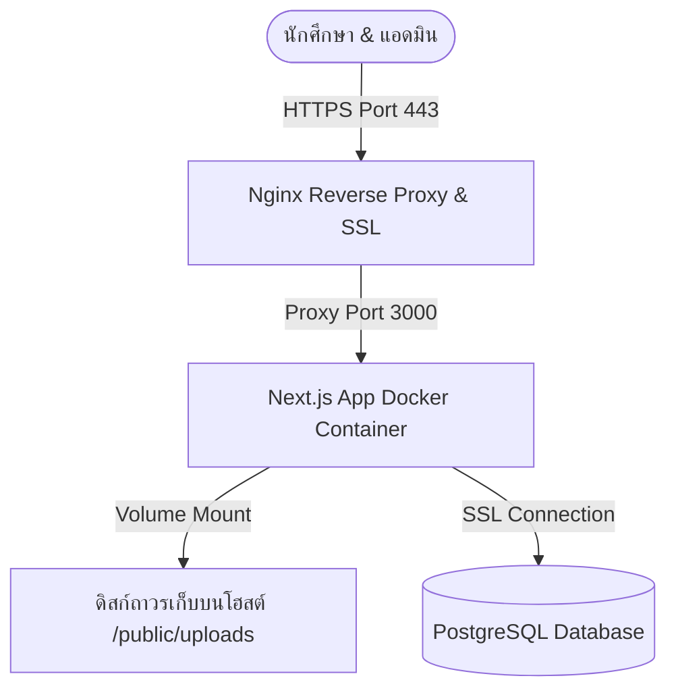
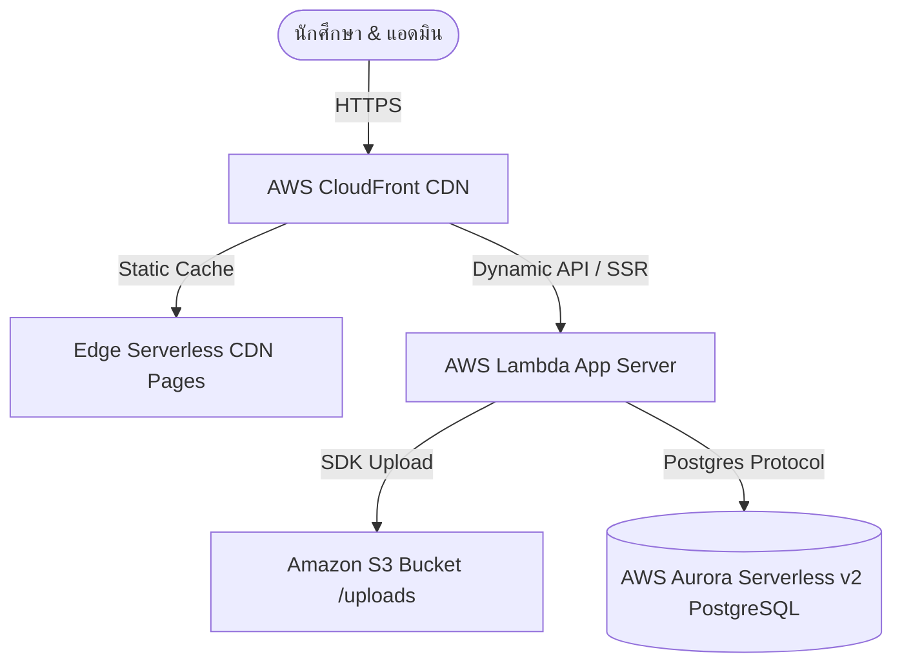

# 🏗️ สถาปัตยกรรมการติดตั้งระบบบนโปรดักชัน (Production Deployment Architecture)

**อัปเดตล่าสุด:** 2026-06-18  
**สถานะ:** เสร็จสมบูรณ์ (เวอร์ชัน 1.2)  
**ลิงก์วิกิหลัก:** [กลับหน้าหลักวิกิ](../wiki.md)

---

เอกสารฉบับนี้สรุปโครงสร้างสถาปัตยกรรมทางเทคนิคที่แนะนำสำหรับการติดตั้ง (Deploy) ระบบ **ActiveCAMT** (Next.js 16 + React 19 + Tailwind v4 + Drizzle + Postgres + NextAuth v5) 

แนวทางการติดตั้งที่เหมาะสมแบ่งออกเป็น 2 แนวทางหลักตามความต้องการ งบประมาณ และรูปแบบการใช้งาน:
1. **แนวทาง A: การรันผ่าน Docker VPS (แนะนำ)** — เหมาะสำหรับการจำกัดงบประมาณรายเดือนแบบคงที่ และรันสถาปัตยกรรมโค้ดเดิมได้ทันที 100%
2. **แนวทาง B: การรันแบบ Serverless (AWS/Vercel)** — เหมาะสำหรับการรองรับคนสแกนพร้อมกันปริมาณมหาศาล (หลายพันคนพร้อมกัน) โดยไม่ต้องกังวลเรื่องการบำรุงรักษาเซิร์ฟเวอร์ระบบปฏิบัติการ

---

## 🛠️ ข้อจำกัดทางเทคนิคของ ActiveCAMT
ก่อนที่จะเลือกโครงสร้างสถาปัตยกรรม ควรทำความเข้าใจกับข้อจำกัดทางเทคนิคดังต่อไปนี้ก่อน:
* **การบันทึกภาพอัปโหลดรูปโปสเตอร์/โปรไฟล์ (`/api/upload`)**: ค่าเริ่มต้นของระบบจะบันทึกลงในดิสก์ของเครื่องโดยตรงที่โฟลเดอร์ `/public/uploads/`
  * *ข้อควรระวัง:* หากนำระบบขึ้นรันบนสถาปัตยกรรมแบบ Serverless (เช่น AWS Lambda หรือ Vercel) ซึ่งเป็นแบบไม่มีดิสก์ถาวร (Ephemeral Filesystem) ข้อมูลรูปที่เก็บไว้ในโฟลเดอร์นี้จะสูญหายทันทีเมื่อฟังก์ชันรีสตาร์ท ดังนั้นหากต้องการใช้ Serverless จะต้องเขียน API การอัปโหลดรูปภาพใหม่เพื่อไปเก็บไว้ใน Cloud Storage เช่น **Amazon S3** หรือ **Cloudflare R2**
* **NextAuth v5 (Google OAuth)**: ต้องระบุที่อยู่ไอพีหรือโดเมนการ Callback ของ OAuth ให้ตรงกับที่ลงทะเบียนไว้ในหน้า Google Cloud Console (เช่น `https://activecamt.university.ac.th/api/auth/callback/google`)
* **Drizzle ORM & Migrations**: ต้องรันสคริปต์แก้ไขและอัปเดตสคีมาฐานข้อมูลทุกครั้งที่มีการอัปเดต โดยเรียกใช้งานคำสั่ง `npm run db:migrate`

---

## 🏗️ แนวทาง A: ติดตั้งบน Containerized VPS (แนะนำสำหรับสถาบันการศึกษา)
แนวทางนี้จะรันส่วนประกอบของระบบบน Container (Docker) ในเครื่องเซิร์ฟเวอร์เสมือน (เช่น **VMware ของวิทยาลัย**, **AWS EC2**, หรือ **DigitalOcean**) โดยเมาท์โฟลเดอร์เก็บข้อมูลโปสเตอร์ไว้กับโฮสต์เซิร์ฟเวอร์โดยตรง

### 📐 แผนผังการติดตั้ง (Architecture Diagram)

### 📋 ส่วนประกอบสำคัญทางเทคนิค
1. **Virtual Machine**: แนะนำให้ใช้ Ubuntu Server v20.04/v22.04 LTS (ประสิทธิภาพขั้นต่ำที่แนะนำ: CPU 2 Cores, RAM 4GB)
2. **Reverse Proxy & SSL**: คอนเทนเนอร์ **Nginx** ร่วมกับโปรแกรม **Certbot (Let's Encrypt)** เพื่อเปิดใช้งาน HTTPS แบบต่ออายุอัตโนมัติทุก 3 เดือน
3. **Application Container**: คอนเทนเนอร์ Next.js รันตัวแอปที่ทำการ Build แบบ Production (`npm run build` และเรียกคำสั่งเริ่มทำงานด้วย `node server.js` ใน standalone mode)
4. **Persistent Volume**: เมาท์พาร์ทโฟลเดอร์รูปภาพอัปโหลด `/app/public/uploads` ออกไปนอกคอนเทนเนอร์เก็บบนเครื่องแม่ (Host) เพื่อป้องกันรูปภาพหายขณะกดอัปเดตเวอร์ชันซอฟต์แวร์
5. **Database**: 
   * *แนะนำสูงสุด:* การเชื่อมต่อฐานข้อมูล PostgreSQL แบบแยกออกไปต่างหากเพื่อความปลอดภัย (Managed Database)
   * *แบบประหยัดงบ:* รันฐานข้อมูล PostgreSQL บนเครื่อง VPS เดียวกันผ่านคอนเทนเนอร์ Docker โดยเขียนสคริปต์แบ็กอัปข้อมูลเป็นระยะส่งไปยัง Cloud Storage

---

## ☁️ แนวทาง B: ติดตั้งบนสถาปัตยกรรม Serverless
เหมาะอย่างยิ่งสำหรับงานขนาดใหญ่ระดับมหาวิทยาลัยที่นักศึกษาหลายพันคนจะกรอกประวัติและเช็คอินพร้อมกันในช่วงเวลาสั้นๆ (เช่น สัปดาห์แรกของภาคการศึกษา)

### 📐 แผนผังการติดตั้งแบบ Serverless

### 📋 ส่วนประกอบที่สำคัญ
1. **Deployment Platform**: พัฒนาขึ้นโดยใช้ **Vercel** หรือ **AWS SST (Serverless Stack)** ในการแปลง Next.js ให้เป็นฟังก์ชัน Serverless (OpenNext)
2. **Compute Engine**: **AWS Lambda** ทำหน้าที่ประมวลผลเซิร์ฟเวอร์คอมโพเนนต์และ API โดยคิดค่าใช้จ่ายตามเวลาใช้งานจริงและปรับสเกลขนาดเป็น 0 ทันทีหากไม่มีผู้ใช้งานออนไลน์
3. **File Storage**: ใช้ **Amazon S3** หรือ **Cloudflare R2** ในการเก็บข้อมูลรูปโปรไฟล์และรูปภาพโปสเตอร์กิจกรรมทั้งหมด
4. **Database Connection Pool**: แนะนำให้ใช้ฐานข้อมูล Serverless เช่น **Amazon Aurora Serverless v2** ร่วมกับ **RDS Proxy** เนื่องจากสถาปัตยกรรม Serverless สามารถเปิดเซสชันการต่อเชื่อมเข้ามาพร้อมกันจำนวนมาก (Connection Starvation) ซึ่งอาจทำให้ฐานข้อมูลปกติล่มได้ง่าย

---

## ⚖️ เปรียบเทียบข้อดี-ข้อเสียประกอบการตัดสินใจ

| หัวข้อเปรียบเทียบ | Containerized VPS (แนวทาง A) | AWS Serverless (แนวทาง B) |
| :--- | :--- | :--- |
| **จุดเด่นหลัก** | ค่าใช้จ่ายรายเดือนคงที่, นำซอร์สโค้ดปัจจุบันไปรันได้เลย 100% | ปรับขยายขีดความสามารถอัตโนมัติไม่จำกัด, ไม่ต้องตั้งค่า OS |
| **งบประมาณโดยประมาณ** | คงที่ประมาณ **500 - 1,000 บาท/เดือน** | แปรผันตามจำนวนสแกน **150 ถึง 3,000+ บาท/เดือน** |
| **ความซับซ้อนการตั้งค่า** | ปานกลาง (ตั้งค่า Docker และ Nginx SSL ครั้งเดียว) | สูง (ตั้งค่าบัญชี AWS Cloud, S3 Buckets, IAM สิทธิ์) |
| **ความเหมาะสม** | เหมาะกับการจัดกิจกรรมภายในวิทยาลัย หรือจัดโดยคณะ | เหมาะกับกิจกรรมระดับมหาวิทยาลัย หรือมีผู้ใช้พร้อมกันปริมาณสูงมาก |

---

## Related Documents
- [01-system-design.md](../../software/01-system-design.md) — โครงสร้างและโมดูลระบบย่อย
- [deployment-guide.md](./deployment-guide.md) — คู่มือขั้นตอนการติดตั้งบน VPS วิทยาลัย
