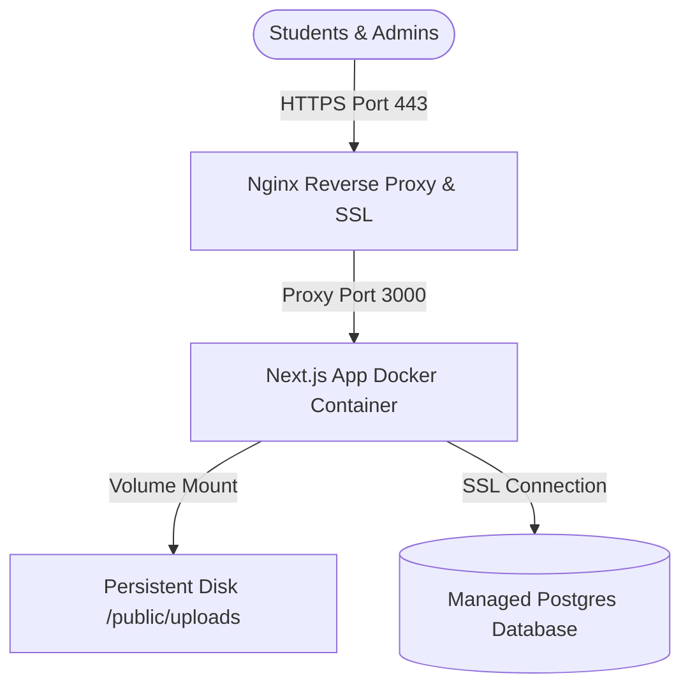
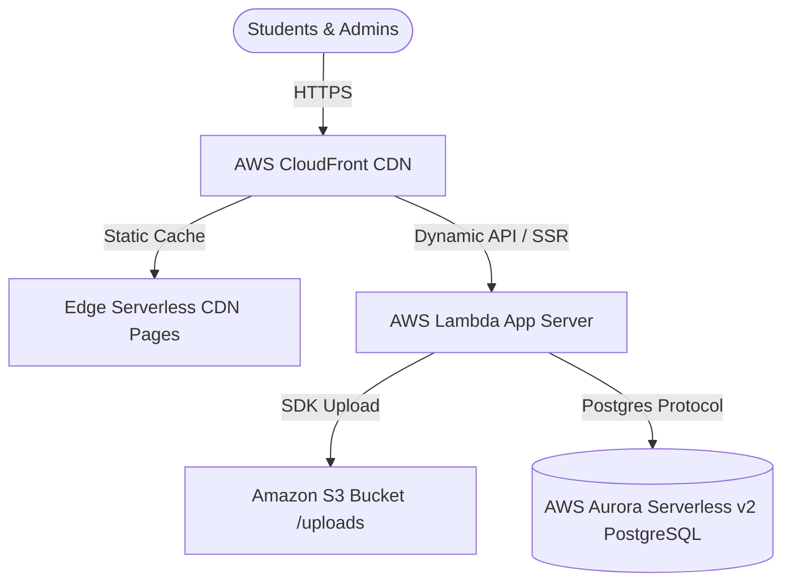

# ActiveCAMT Production Deployment Architecture Blueprint

This document outlines the recommended production-grade architecture blueprints for deploying the **ActiveCAMT** ecosystem (Next.js 16 + React 19 + Tailwind v4 + Drizzle + Postgres + NextAuth v5). 

Depending on your budget, traffic patterns, and operational complexity, there are two optimal strategies:
1. **Option A: Containerized VPS (AWS EC2 / DigitalOcean)** — *Recommended for flat, predictable pricing, keeping the codebase completely unchanged.*
2. **Option B: AWS Serverless (Vercel + RDS / SST on AWS)** — *Recommended for high scaling (thousands of students scanning QR codes simultaneously) and zero server maintenance.*

---

## 🛠️ The Technical Constraints of ActiveCAMT
Before selecting an architecture, we must analyze the specific dependencies of the ActiveCAMT codebase:
* **Dynamic File Uploads (`/api/upload`)**: Uploads are currently saved to the local disk at `public/uploads/` using the Node.js `fs` module. 
  > [!WARNING]
  > Serverless runtimes (like AWS Lambda, Vercel, or AWS Amplify) have **ephemeral filesystems**. Any image uploaded locally will disappear when the Lambda container recycles. Serverless deployment *requires* modifying `/api/upload` to store files in **Amazon S3** or **Cloudflare R2**.
* **NextAuth v5 (Google OAuth)**: Requires a fixed production URL callback configured in the Google Cloud Console (e.g., `https://activecamt.yourdomain.com/api/auth/callback/google`).
* **Drizzle ORM & Migrations**: Requires running migrations on the target database during deployment using `npm run db:migrate`.

---

## 🏗️ Option A: Containerized VPS Architecture (Recommended)
This approach places your application inside Docker containers running on a virtual machine (such as **AWS EC2**, **DigitalOcean**, or **Hetzner**). It uses a local persistent volume for image uploads, allowing the codebase to run out of the box with zero changes.

### 📐 Architecture Diagram


### 📋 Technical Components
1. **Virtual Machine**: AWS EC2 instance (recommend **t4g.medium** for 4GB ARM64 RAM - highly cost-efficient and high performance).
2. **Reverse Proxy & SSL**: **Nginx** container configured with Let's Encrypt certificates using **Certbot** for automatic SSL renewal.
3. **Application Layer**: **Docker Engine** running a Next.js production build (`npm run build` followed by `npm run start`).
4. **Persistent Storage**: Docker volume mapping `public/uploads` to the host directory, ensuring uploads persist across software updates.
5. **Database**: 
   * *Best Practice*: Managed **AWS RDS PostgreSQL** (t4g.micro or t4g.small) for automated daily backups, high security, and high availability.
   * *Budget Choice*: PostgreSQL running as a Docker container on the same server, with backups pushed to AWS S3 using a simple cron job.

### ⚙️ Step-by-Step Deployment Guide (Option A)

#### 1. Define the `Dockerfile` in `/activecamt`
Create a multi-stage production Dockerfile to build a minimized Next.js image:

```dockerfile
# Stage 1: Install dependencies
FROM node:20-alpine AS deps
RUN apk add --no-cache libc6-compat
WORKDIR /app
COPY package*.json ./
RUN npm ci

# Stage 2: Rebuild the source code only when needed
FROM node:20-alpine AS builder
WORKDIR /app
COPY --from=deps /app/node_modules ./node_modules
COPY . .
ENV NEXT_TELEMETRY_DISABLED=1
ENV NODE_ENV=production
RUN npm run build

# Stage 3: Runner
FROM node:20-alpine AS runner
WORKDIR /app
ENV NODE_ENV=production
ENV PORT=3000
ENV HOSTNAME="0.0.0.0"

RUN addgroup --system --gid 1001 nodejs
RUN adduser --system --uid 1001 nextjs

COPY --from=builder /app/public ./public
COPY --from=builder --chown=nextjs:nodejs /app/.next/standalone ./
COPY --from=builder --chown=nextjs:nodejs /app/.next/static ./.next/static
COPY --from=builder --chown=nextjs:nodejs /app/src/db ./src/db
COPY --from=builder --chown=nextjs:nodejs /app/drizzle ./drizzle
COPY --from=builder --chown=nextjs:nodejs /app/node_modules ./node_modules
COPY --from=builder --chown=nextjs:nodejs /app/package.json ./package.json

USER nextjs
EXPOSE 3000

CMD ["node", "server.js"]
```
*(Note: To use `standalone` output, add `output: "standalone"` to `next.config.ts`)*

#### 2. Create the `docker-compose.yml`
This manages both the Next.js application, the Nginx reverse proxy, and automated SSL.

```yaml
version: '3.8'

services:
  web:
    build: .
    restart: always
    environment:
      - DATABASE_URL=${DATABASE_URL}
      - NEXTAUTH_SECRET=${NEXTAUTH_SECRET}
      - AUTH_GOOGLE_ID=${AUTH_GOOGLE_ID}
      - AUTH_GOOGLE_SECRET=${AUTH_GOOGLE_SECRET}
      - NEXTAUTH_URL=${NEXTAUTH_URL}
    ports:
      - "3000:3000"
    volumes:
      - uploads-data:/app/public/uploads

  nginx:
    image: nginx:alpine
    restart: always
    ports:
      - "80:80"
      - "443:443"
    volumes:
      - ./nginx.conf:/etc/nginx/nginx.conf:ro
      - /etc/letsencrypt:/etc/letsencrypt:ro

volumes:
  uploads-data:
    driver: local
```

---

## ☁️ Option B: AWS Serverless Architecture
If your application experiences massive bursts of traffic (e.g., thousands of students scanning QR codes simultaneously during onboarding or event sign-in, followed by weeks of inactivity), AWS Serverless is the superior architecture.

### 📐 Architecture Diagram


### 📋 Technical Components
1. **Deployment Pipeline (Framework)**: **Vercel** or **AWS SST (Serverless Stack)**. SST deploys Next.js directly onto AWS Lambda and CloudFront using the OpenNext project.
2. **Compute**: **AWS Lambda** executes the Next.js server components and API routes. Scales down to exactly 0 execution costs when no users are online.
3. **Asset Storage**: **Amazon S3** + **Amazon CloudFront** to serve uploaded posters and images.
4. **Database**: **Amazon Aurora Serverless v2** or **Amazon RDS PostgreSQL** (with RDS Proxy to manage connection pooling, since serverless lambdas can spawn hundreds of simultaneous connections).

### 🛠️ Required Code Modifications for Option B
If you choose Serverless, you **must** update the image upload function to save to S3 instead of local disk.

#### Modified `/api/upload/route.ts` using AWS SDK:
```typescript
import { auth } from "@/auth";
import { NextResponse } from "next/server";
import { S3Client, PutObjectCommand } from "@aws-sdk/client-s3";
import path from "path";

const s3Client = new S3Client({
  region: process.env.AWS_REGION,
  credentials: {
    accessKeyId: process.env.AWS_ACCESS_KEY_ID!,
    secretAccessKey: process.env.AWS_SECRET_ACCESS_KEY!,
  },
});

export async function POST(req: Request) {
  try {
    const session = await auth();
    if (!session?.user) {
      return NextResponse.json({ error: "Unauthorized" }, { status: 401 });
    }

    const formData = await req.formData();
    const file = formData.get("file") as File;
    if (!file) return NextResponse.json({ error: "No file" }, { status: 400 });

    const allowedExts = [".jpg", ".jpeg", ".png", ".webp", ".gif"];
    const ext = path.extname(file.name).toLowerCase();
    if (!allowedExts.includes(ext)) {
      return NextResponse.json({ error: "Invalid file extension" }, { status: 400 });
    }

    const bytes = await file.arrayBuffer();
    const buffer = Buffer.from(bytes);
    
    const s3Key = `uploads/${Date.now()}-${file.name.replace(/\s+/g, "-")}`;

    await s3Client.send(
      new PutObjectCommand({
        Bucket: process.env.AWS_S3_BUCKET_NAME!,
        Key: s3Key,
        Body: buffer,
        ContentType: file.type,
      })
    );

    const publicUrl = `https://${process.env.AWS_S3_BUCKET_NAME}.s3.${process.env.AWS_REGION}.amazonaws.com/${s3Key}`;
    return NextResponse.json({ url: publicUrl });
  } catch (error) {
    console.error("S3 Upload error:", error);
    return NextResponse.json({ error: "Upload Failed" }, { status: 500 });
  }
}
```

---

## 🔒 Production Security Hardening Checklist

Regardless of which architecture you select, you must implement the following security measures:

### 1. Database Protection
* **No Public Access**: Never expose port `5432` of your database to the internet. Keep the database strictly within a private VPC subnet.
* **VPC Peering/Security Groups**: Restrict inbound database traffic solely to the security group associated with the EC2 container or Lambda execution role.
* **SSL Client Connections**: Always append `?sslmode=require` or config variables in your connection string to prevent packet sniffing.

### 2. NextAuth Configuration
* Generate a strong secure session secret key:
  ```bash
  openssl rand -base64 33
  ```
  Set this as `NEXTAUTH_SECRET` in your server `.env` file.
* Make sure `NEXTAUTH_URL` is explicitly set to `https://activecamt.yourdomain.com`.

### 3. Rate Limiting Protection (Implemented)
* Ensure reverse proxies (like Nginx, Cloudflare, or AWS CloudFront) forward client IPs properly using the `X-Forwarded-For` header. Our integrated rate limiter depends on accurate IP extraction to protect scan and authentication routes.

---

## 🗳️ Recommendation Summary

| Feature Category | Containerized VPS (Option A) | AWS Serverless (Option B) |
| :--- | :--- | :--- |
| **Primary Advantage** | Predictable monthly cost; keeps codebase 100% intact. | Infinite auto-scaling; zero system upkeep or OS configuration. |
| **Est. Monthly Cost** | **$15 - $30** (flat fee) | **$5 - $100+** (highly variable by traffic) |
| **Complexity** | Simple Docker configuration. | Moderate; requires AWS account config, S3 setup. |
| **Best Suited For** | Internal school committees, small-to-medium user bases. | Large universities, campus-wide events with spikes. |

> [!TIP]
> **Antigravity's Recommendation:** For a fast, stable, and highly secure release, start with **Option A (Containerized VPS using AWS EC2 + AWS RDS)**. It keeps your file uploads local and simple while securing your data within a managed RDS environment. As the system scales to campus-wide adoption, you can easily shift to **Option B (Serverless)** by configuring AWS S3 bucket uploads.
